# 并发

## 程序、进程、线程、协程

### 程序(program)
是为完成特定任务、用某种语言编写的一组指令的集合,是一段静态的代码。 （程序是静态的）

### 进程(process)
是程序的一次执行过程。正在运行的一个程序，进程作为资源分配的单位，在内存中会为每个进程分配不同的内存区域。 （进程是动态的）是一个动的过程 ，进程的生命周期  :  有它自身的产生、存在和消亡的过程 


### 线程(thread)
进程可进一步细化为线程， 是一个程序内部的一条执行路径。
若一个进程同一时间并行执行多个线程，就是支持多线程的。 
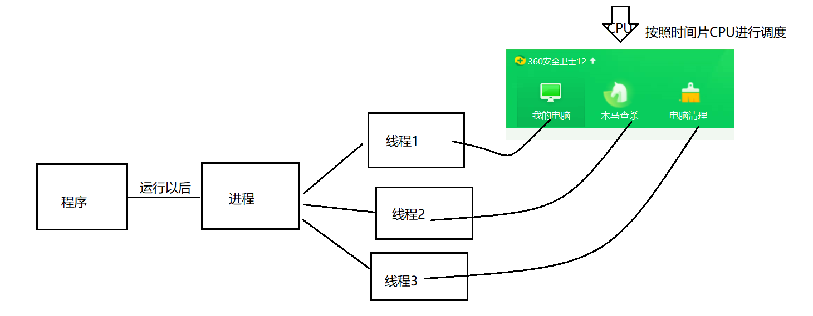

### 协程(goroutine)
又称为微线程，纤程，协程是一种用户态的轻量级线程

作用:在执行A函数的时候，可以随时中断，去执行B函数，然后中断继续执行A函数(可以自动切换)，注意这一切换过程并不是函数调用（没有调用语句)，过程很像多线程，然而协程中只有一个线程在执行（协程的本质是个单线程）
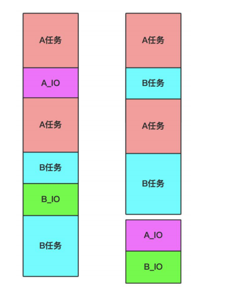
                                                   
对于单线程下，我们不可避免程序中出现io操作，但如果我们能在自己的程序中(即用户程序级别，而非操作系统级别)控制单线程下的多个任务能在一个任务遇到io阻塞时就将寄存器上下文和栈保存到某个其他地方，然后切换到另外一个任务去计算。在任务切回来的时候，恢复先前保存的寄存器上下文和栈，这样就保证了该线程能够最大限度地处于就绪态，即随时都可以被cpu执行的状态，相当于我们在用户程序级别将自己的io操作最大限度地隐藏起来，从而可以迷惑操作系统，让其看到：该线程好像是一直在计算，io比较少，从而会更多的将cpu的执行权限分配给我们的线程（注意:线程是CPU控制的，而协程是程序自身控制的，属于程序级别的切换，操作系统完全感知不到，因而更加轻量级)

## 协程入门

### 案例1：
请编写一个程序，完成如下功能:
（1）在主线程中，开启一个goroutine，该goroutine每隔1秒输出"hello golang"
（2）在主线程中也每隔一秒输出"hello msb"，输出10次后，退出程序
（3）要求主线程和goroutine同时执行

代码：
```go 
package main
import(
        "fmt"
        "strconv"
        "time"
)
func test(){
        for i := 1;i <= 10;i++ {
                fmt.Println("hello golang + " + strconv.Itoa(i))
                //阻塞一秒：
                time.Sleep(time.Second)
        }
}
func main(){//主线程
        go test() //开启一个协程
        for i := 1;i <= 10;i++ {
                fmt.Println("hello msb + " + strconv.Itoa(i))
                //阻塞一秒：
                time.Sleep(time.Second)
        }
}
```

代码结果：
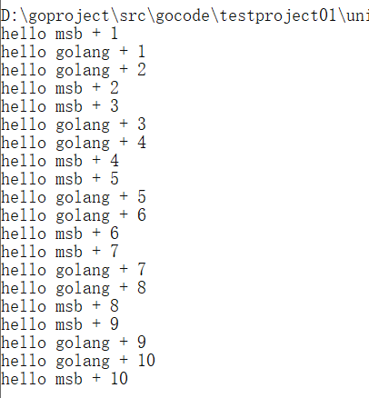


主线程和协程执行流程示意图：

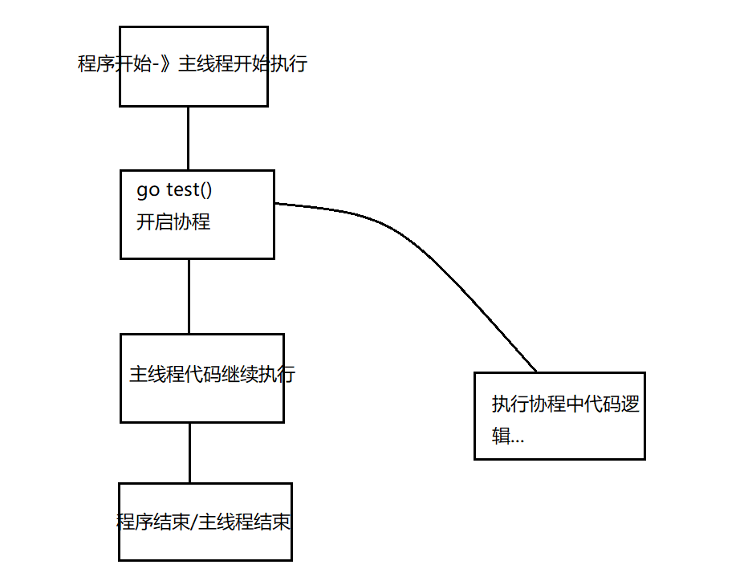


### 主死从随
【1】主死从随：
1) 如果主线程退出了，则协程即使还没有执行完毕，也会退出
2) 当然协程也可以在主线程没有退出前，就自己结束了，比如完成了自己的任务
```go
package main
import(
        "fmt"
        "strconv"
        "time"
)
func test(){
        for i := 1;i <= 1000;i++ {
                fmt.Println("hello golang + " + strconv.Itoa(i))
                //阻塞一秒：
                time.Sleep(time.Second)
        }
}
func main(){//主线程
        go test() //开启一个协程
        for i := 1;i <= 10;i++ {
                fmt.Println("hello msb + " + strconv.Itoa(i))
                //阻塞一秒：
                time.Sleep(time.Second)
        }
}
```


### 启动多个协程
【1】案例：
```go
package main
import(
        "fmt"
        "time"
)
func main(){
        //匿名函数+外部变量 = 闭包
        for i := 1;i <= 5;i++ {
                //启动一个协程
                //使用匿名函数，直接调用匿名函数
                go func(n int){
                        fmt.Println(n)
                }(i)
        }
        time.Sleep(time.Second * 2)
}
```


### 使用WaitGroup控制协程退出

#### WaitGroup的作用：
WaitGroup用于等待一组线程的结束。父线程调用Add方法来设定应等待的线程的数量。每个被等待的线程在结束时应调用Done方法。同时，主线程里可以调用Wait方法阻塞至所有线程结束。---》解决主线程在子协程结束后自动结束

#### 主要方法

（1）Add()方法

`func(*WaitGroup） Add()`
> - Add()方法内部计数器加上delta，delta可以是负数；
> - 如果内部计数器变为0，则Wait()方法会将处于阻塞等待的所有goroutine释放；
> - 如果计数器小于0，则调用panic()函数；
> - Add()方法加上正数的调用应在Wait()方法之前，否则Wait()方法可能只会等待很少的goroutine；
> - Add()方法在创建新的goroutine或者其它等待的事件之前调用

（2）Done()方法 

Done函数调用的也是Add函数，主要用于-1操作；

`func(wg *WaitGroup) Done()`
> - Done()方法会减少WaitGroup计数器的值，一般在goroutine的最后执行；

（3）Wait()方法 

阻塞当前协程，直到等待数归为0才继续向下执行；

`func (wg *WaitGroup) Wait()`
> - Wait()方法会阻塞，知道WaitGroup计数器减为0.


Add()、Done()、Wait()三者对比: 

> - 在三个方法中，使用Add()方法添加计数，使用Done()方法减掉一个计数，如果计数不为0，则会阻塞Wait()方法的运行；
> - 一个goroutine调用Add()方法来设定等待的goroutine的数量；
> - 每个被等待的goroutine在结束时调用Done()方法；
> - 在主goroutine里可以调用Wait()方法阻塞至所有goroutine结束；

#### 案例：

（1）Add\Done\Wait:

```go
package main
import(
        "fmt"
        "sync"
)
var wg sync.WaitGroup //只定义无需赋值
func main(){
        //启动五个协程
        for i := 1 ;i <= 5;i++ {
                wg.Add(1) //协程开始的时候加1操作
                go func(n int){
                        fmt.Println(n)
                        wg.Done()  //协程执行完成减1
                }(i)
        }
        //主线程一直在阻塞，什么时候wg减为0了，就停止
        wg.Wait()
}

```

（2）如果防止忘记计数器减1操作，结合defer关键字使用：
```go
package main
import(
        "fmt"
        "sync"
)
var wg sync.WaitGroup //只定义无需赋值
func main(){
        //启动五个协程
        for i := 1 ;i <= 5;i++ {
                wg.Add(1) //协程开始的时候加1操作
                go func(n int){
                        defer wg.Done()
                        fmt.Println(n)		
                }(i)
        }
        //主线程一直在阻塞，什么时候wg减为0了，就停止
        wg.Wait()
}
```

（3）可以最开始在知道协程次数的情况下先Add操作：

```go
package main
import(
        "fmt"
        "sync"
)
var wg sync.WaitGroup //只定义无需赋值
func main(){
        wg.Add(5)
        //启动五个协程
        for i := 1 ;i <= 5;i++ {
                go func(n int){
                        defer wg.Done()
                        fmt.Println(n)		
                }(i)
        }
        //主线程一直在阻塞，什么时候wg减为0了，就停止
        wg.Wait()
}

```

注意：Add中加入的数字和协程的次数一定要保持一致


## 多个协程操纵同一数据案例(互斥锁)

### 案例：多个协程操纵同一数据  

```go
package main
import(
        "fmt"
        "sync"
)
//定义一个变量：
var totalNum int
var wg sync.WaitGroup //只定义无需赋值
func add(){
        defer wg.Done()
        for i := 0 ;i < 100000;i++{
                totalNum = totalNum + 1
        }
}
func sub(){
        defer wg.Done()
        for i := 0 ;i < 100000;i++{
                totalNum = totalNum - 1
        }
}
func main(){
        wg.Add(2)
        //启动协程
        go add()
        go sub()
        wg.Wait()
        fmt.Println(totalNum)
}
```
结果：在理论上，这个totalNum结果应该是0 ，无论协程怎么交替执行，最终想象的结果就是0
但是事实上：不是
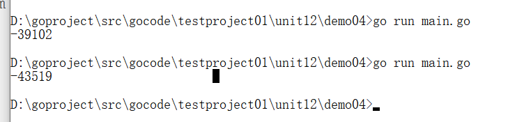

问题出现的原因：（图解为其中一种可能性）
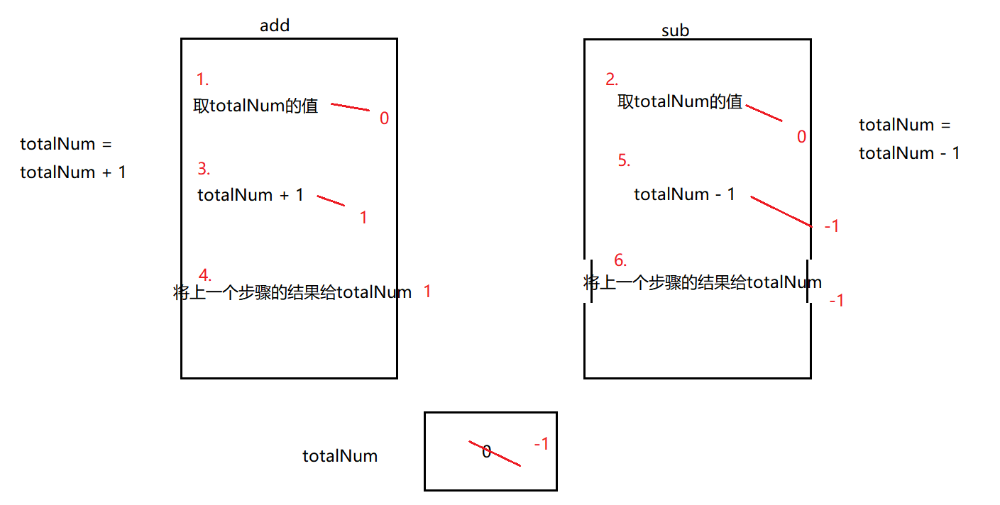


解决问题：
有一个机制：确保：一个协程在执行逻辑的时候另外的协程不执行
----》锁的机制---》加入互斥锁

`sync`: https://pkg.go.dev/sync

`sync.Mutex`: https://pkg.go.dev/sync#Mutex
```go
func (m *Mutex) Lock()
func (m *Mutex) TryLock() bool
func (m *Mutex) Unlock()
```

代码：
```go

package main
import(
        "fmt"
        "sync"
)
//定义一个变量：
var totalNum int
var wg sync.WaitGroup //只定义无需赋值
//加入互斥锁：
var lock sync.Mutex
func add(){
        defer wg.Done()
        for i := 0 ;i < 100000;i++{
                //加锁
                lock.Lock()
                totalNum = totalNum + 1
                //解锁：
                lock.Unlock()
        }
}
func sub(){
        defer wg.Done()
        for i := 0 ;i < 100000;i++{
                //加锁
                lock.Lock()
                totalNum = totalNum - 1
                //解锁：
                lock.Unlock()
        }
}
func main(){
        wg.Add(2)
        //启动协程
        go add()
        go sub()
        wg.Wait()
        fmt.Println(totalNum)
}
```

### 读写锁的使用

golang中sync包实现了两种锁Mutex （互斥锁）和RWMutex（读写锁）

- 互斥锁

其中Mutex为互斥锁，Lock()加锁，Unlock()解锁，使用Lock()加锁后，便不能再次对其进行加锁，直到利用Unlock()解锁对其解锁后，才能再次加锁．适用于读写不确定场景，即读写次数没有明显的区别
----性能、效率相对来说比较低

- 读写锁
RWMutex是一个读写锁，其经常用于读次数远远多于写次数的场景．

---在读的时候，数据之间不产生影响，   写和读之间才会产生影响


#### 案例

```go
package main
import(
        "fmt"
        "sync"
        "time"
)
var wg sync.WaitGroup //只定义无需赋值
//加入读写锁：
var lock sync.RWMutex
func read(){
        defer wg.Done()
        lock.RLock()//如果只是读数据，那么这个锁不产生影响，但是读写同时发生的时候，就会有影响
        fmt.Println("开始读取数据")
        time.Sleep(time.Second)
        fmt.Println("读取数据成功")
        lock.RUnlock()
}
func write(){
        defer wg.Done()
        lock.Lock()
        fmt.Println("开始修改数据")
        time.Sleep(time.Second * 10)
        fmt.Println("修改数据成功")
        lock.Unlock()
}
func main(){
        wg.Add(6)
        //启动协程 ---> 场合：读多写少
        for i := 0;i < 5;i++ {
                go read()
        }
        go write()
        wg.Wait()
}

```

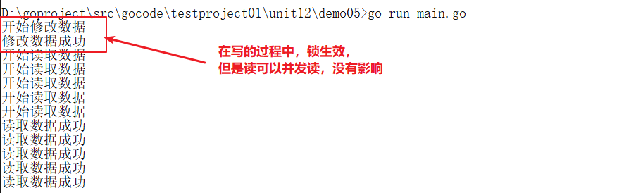

## 管道

### 管道介绍

管道（channel）特质介绍：

1. 管道本质就是一个数据结构-队列
2. 数据是先进先出
3. 自身线程安全，多协程访问时，不需要加锁，channel本身就是线程安全的
4. 管道有类型的，一个string的管道只能存放string类型数据

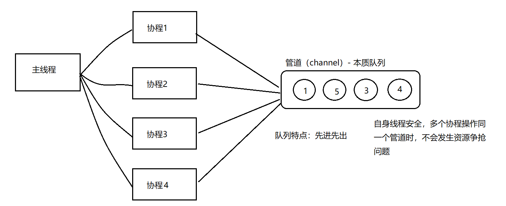

### 管道入门案例

管道的定义：
> var  变量名  chan  数据类型
> PS1：chan管道关键字
> PS2：数据类型指的是管道的类型，里面放入数据的类型，管道是有类型的，int类型的管道只能写入整数int
> PS3：管道是引用类型，必须初始化才能写入数据，即make后才能使用

案例：
```go
package main
import(
        "fmt"
)
func main(){
        //定义管道 、 声明管道 ---> 定义一个int类型的管道
        var intChan chan int
        //通过make初始化：管道可以存放3个int类型的数据
        intChan = make(chan int,3)
        //证明管道是引用类型：
        fmt.Printf("intChan的值：%v",intChan) // 0xc000112080
        //向管道存放数据：
        intChan<- 10
        num := 20
        intChan<- num
        intChan<- 40  
        //注意：不能存放大于容量的数据：
        //intChan<- 80  
        //在管道中读取数据：
        num1 := <-intChan
        num2 := <-intChan
        num3 := <-intChan
        fmt.Println(num1)
        fmt.Println(num2)
        fmt.Println(num3)
        //注意：在没有使用协程的情况下，如果管道的数据已经全部取出，那么再取就会报错：
        num4 := <-intChan
        fmt.Println(num4)
        //输出管道的长度：
        fmt.Printf("管道的实际长度：%v,管道的容量是：%v",len(intChan),cap(intChan))
}

```


### 管道的关闭

**管道的关闭**

使用内置函数close可以关闭管道，当管道关闭后，就不能再向管道写数据了，但是仍然可以从该管道读取数据。

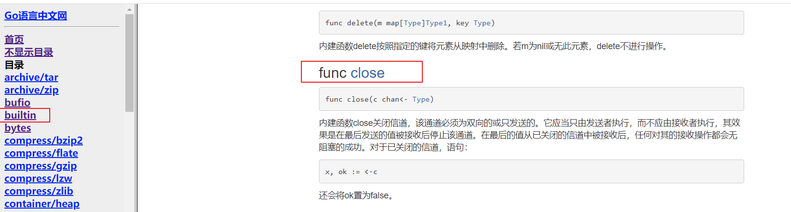

案例
```go
package main
import(
        "fmt"
)
func main(){
        //定义管道 、 声明管道
        var intChan chan int
        //通过make初始化：管道可以存放3个int类型的数据
        intChan = make(chan int,3)
        //在管道中存放数据：
        intChan<- 10
        intChan<- 20
        //关闭管道：
        close(intChan)
        //再次写入数据：--->报错
        //intChan<- 30
        //当管道关闭后，读取数据是可以的：
        num := <- intChan
        fmt.Println(num)
}
```

### 管道的遍历

**管道的遍历**

管道支持for-range的方式进行遍历，请注意两个细节
1)在遍历时，如果管道没有关闭，则会出现deadlock的错误
2)在遍历时，如果管道已经关闭，则会正常遍历数据，遍历完后，就会退出遍历。

案例
```go
package main
import(
        "fmt"
)
func main(){
        //定义管道 、 声明管道
        var intChan chan int
        //通过make初始化：管道可以存放3个int类型的数据
        intChan = make(chan int,100)
        for i := 0;i < 100;i++ {
                intChan<- i
        }
        //在遍历前，如果没有关闭管道，就会出现deadlock的错误
        //所以我们在遍历前要进行管道的关闭
        close(intChan)
        //遍历：for-range
        for v := range intChan {
                fmt.Println("value = ",v)
        }
}
```


### 协程和管道协同工作案例

【1】案例需求：
请完成协程和管道协同工作的案例，具体要求:
1) 开启一个writeData协程，向管道中写入50个整数.
2) 开启一个readData协程，从管道中读取writeData写入的数据。
3) 注意: writeData和readDate操作的是同一个管道
4) 主线程需要等待writeData和readDate协程都完成工作才能退出

【2】原理图：

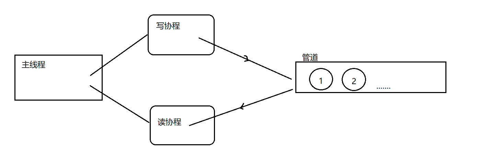


【3】代码：
```go
package main
import(
        "fmt"
        "time"
        "sync"
)
var wg sync.WaitGroup //只定义无需赋值
//写：
func writeData(intChan chan int){
        defer wg.Done()
        for i := 1;i <= 50;i++{
                intChan<- i
                fmt.Println("写入的数据为：",i)
                time.Sleep(time.Second)
        }
        //管道关闭：
        close(intChan)
}
//读：
func readData(intChan chan int){
        defer wg.Done()
        //遍历：
        for v := range intChan{
                fmt.Println("读取的数据为：",v)
                time.Sleep(time.Second)
        }
}
func main(){//主线程
        //写协程和读协程共同操作同一个管道-》定义管道：
        intChan := make(chan int,50)
        wg.Add(2)
        //开启读和写的协程：
        go writeData(intChan)
        go readData(intChan)
        //主线程一直在阻塞，什么时候wg减为0了，就停止
        wg.Wait()	
}
```

运行结果：

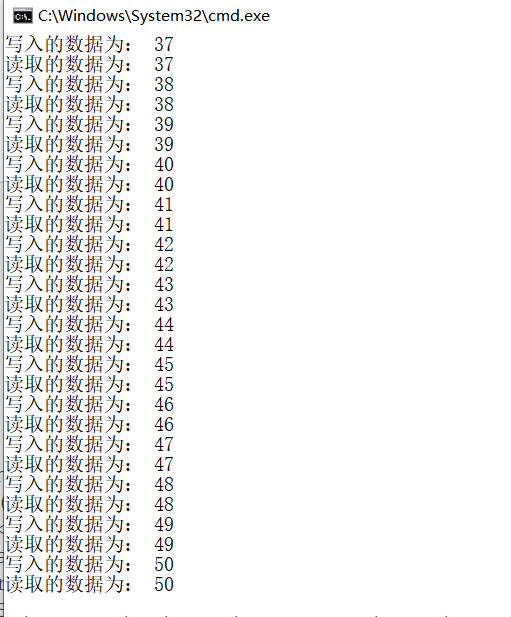


### 声明只读只写管道

【1】管道可以声明为只读或者只写性质

【2】代码：

```go
package main
import(
        "fmt"
)
func main(){
        //默认情况下，管道是双向的--》可读可写：
        //var intChan1 chan int
        //声明为只写：
        var intChan2 chan<- int  // 管道具备<- 只写性质
        intChan2 = make(chan int,3)
        intChan2<- 20
        //num := <-intChan2 报错
        fmt.Println("intChan2:",intChan2)
        //声明为只读：
        var intChan3 <-chan int// 管道具备<- 只读性质 
        if intChan3 != nil {
                num1 := <-intChan3
                fmt.Println("num1:",num1)
        }
        //intChan3<- 30 报错
        
}

```

### 管道的阻塞

【1】当管道只写入数据，没有读取，就会出现阻塞：

```go
package main
import(
        "fmt"
        _"time"
        "sync"
)
var wg sync.WaitGroup //只定义无需赋值
//写：
func writeData(intChan chan int){
        defer wg.Done()
        for i := 1;i <= 10;i++{
                intChan<- i
                fmt.Println("写入的数据为：",i)
                //time.Sleep(time.Second)
        }
        //管道关闭：
        close(intChan)
}
//读：
func readData(intChan chan int){
        defer wg.Done()
        //遍历：
        for v := range intChan{
                fmt.Println("读取的数据为：",v)
                //time.Sleep(time.Second)
        }
}
func main(){//主线程
        //写协程和读协程共同操作同一个管道-》定义管道：
        intChan := make(chan int,10)
        wg.Add(2)
        //开启读和写的协程：
        go writeData(intChan)
        //go readData(intChan)
        //主线程一直在阻塞，什么时候wg减为0了，就停止
        wg.Wait()	
}
```

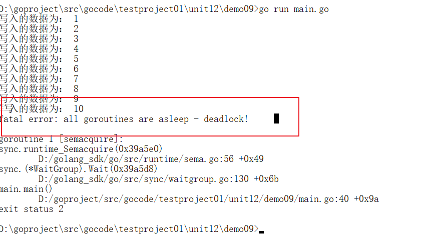

【2】写的快，读的满（管道读写频率不一致），不会出现阻塞问题：

```go
package main
import(
        "fmt"
        "time"
        "sync"
)
var wg sync.WaitGroup //只定义无需赋值
//写：
func writeData(intChan chan int){
        defer wg.Done()
        for i := 1;i <= 10;i++{
                intChan<- i
                fmt.Println("写入的数据为：",i)
                //time.Sleep(time.Second)
        }
        //管道关闭：
        close(intChan)
}
//读：
func readData(intChan chan int){
        defer wg.Done()
        //遍历：
        for v := range intChan{
                fmt.Println("读取的数据为：",v)
                time.Sleep(time.Second)
        }
}
func main(){//主线程
        //写协程和读协程共同操作同一个管道-》定义管道：
        intChan := make(chan int,10)
        wg.Add(2)
        //开启读和写的协程：
        go writeData(intChan)
        go readData(intChan)
        //主线程一直在阻塞，什么时候wg减为0了，就停止
        wg.Wait()	
}
```

## select功能

【1】select功能：解决多个管道的选择问题，也可以叫做多路复用，可以从多个管道中随机公平地选择一个来执行

> PS：case后面必须进行的是io操作，不能是等值，随机去选择一个io操作
> 
> PS：default防止select被阻塞住，加入default


【2】代码：

```go
package main
import(
        "fmt"
        "time"
)
func main(){
        //定义一个int管道：
        intChan := make(chan int,1)
        go func(){
                time.Sleep(time.Second * 15)
                intChan<- 10
        }()
        //定义一个string管道：
        stringChan := make(chan string,1)
        go func(){
                time.Sleep(time.Second * 12)
                stringChan<- "msbgolang"
        }()
        //fmt.Println(<-intChan)//本身取数据就是阻塞的
        select{
                case v := <-intChan :
                        fmt.Println("intChan:",v)
                case v := <-stringChan :
                        fmt.Println("stringChan:",v)
                default:
                        fmt.Println("防止select被阻塞")
        }
}
```


