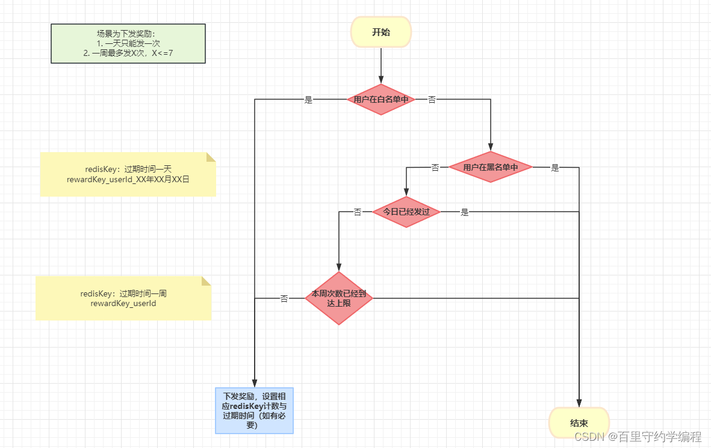

# redis

参考: https://redis.uptrace.dev/zh/guide/go-redis.html

## 安装redis

```bash
docker run -it --network host --rm redis:5.0.7 redis-cli

```

## go 操作 redis

### 连接

依赖包: `go get github.com/go-redis/redis/v9`

```go

package main

import (
	"context"
	"fmt"
	"github.com/go-redis/redis/v9"
)

var rdb *redis.Client
var ctx = context.Background()

func init() {
    // 单机模式
	config := &redis.Options{
		Addr:         "localhost:6379",
		Password:     "",
		DB:           0,    // 使用默认DB
		PoolSize:     15,   // 连接池连接数量
		MinIdleConns: 10,   //在启动阶段创建指定数量的Idle连接，并长期维持idle状态的连接数不少于指定数量；。
		//超时
		//DialTimeout:  5 * time.Second, //连接建立超时时间，默认5秒。
		//ReadTimeout:  3 * time.Second, //读超时，默认3秒， -1表示取消读超时
		//WriteTimeout: 3 * time.Second, //写超时，默认等于读超时
		//PoolTimeout:  4 * time.Second, //当所有连接都处在繁忙状态时，客户端等待可用连接的最大等待时长，默认为读超时+1秒。
	}

    /*
    // 哨兵模式
    rdb := redis.NewFailoverClient(&redis.FailoverOptions{
        MasterName:    "master",
		SentinelAddrs: []string{"x.x.x.x:26379", "xx.xx.xx.xx:26379", "xxx.xxx.xxx.xxx:26379"},
    })
    
    // 集群模式
    rdb := redis.NewClusterClient(&redis.ClusterOptions{
        Addrs: []string{":7000", ":7001", ":7002", ":7003", ":7004", ":7005"},

        // To route commands by latency or randomly, enable one of the following.
        //RouteByLatency: true,
        //RouteRandomly: true,
    })
    */
	rdb = redis.NewClient(config)
    ctx, cancel := context.WithTimeout(context.Background(), time.Second*10)
    defer cancel()
    _, err := rdb.Ping(ctx).Result() // 检查连接redis是否成功
    if err != nil {
        fmt.Println("Connect Failed: %v \n", err)
        panic(err)
    }
}

func main() {
    // 关闭连接
    defer func() {
        if err := rdb.Close(); err != nil {
            panic(err)
        }

    }
    // 设置key-value,ttl
	rdb.Set(ctx, "name", "zhangsan", 0)
	val, err := rdb.Get(ctx, "name").Result()
	if err != nil {
		fmt.Println("读取错误", err)
	}
	fmt.Println(fmt.Sprintf("key:name,val:%s", val))

    
}

```

### 基本操作

#### key相关操作

```go

// 设置值、取值、设置过期时间、判断key是否存在、key不存在时才设置值、删除等
func Test_Base(t *testing.T) {
	//  添加key,0表示没有过期时间
	rdb.Set(ctx, "testKey", "xxx", 0)

    //  设置key过期时间 成功true
	rdb.Expire(ctx, "testKey", time.Second*60)

	//  获取值
	val, err := rdb.Get(ctx, "testKey").Result()
	if err != nil {
		fmt.Println("错误", err)
	}
	fmt.Println("值：", val)

    // 判断键是否存在
    exists, err := rdb.Exists(ctx, "testKey").Result()
    if err != nil {
        panic(err)
    }

    if exists == 1 {
        fmt.Println("键存在")
    } else if exists == 0 {
        fmt.Println("键不存在")
    } else {
        fmt.Println("判断键是否存在失败")
    }

	//  key不存在时设置值
	rdb.SetNX(ctx, "unkey", "val", 0)
	rdb.Set(ctx, "testKey2", "xxx", 0)

	//  删除key 可删除多个
	rdb.Del(ctx, "testKey2", "testKey")
}

```

#### 字符串 String

```go
// 设置、读取、加、减、获取过期时间、模糊查询key，遍历模糊查询结果等
func Test_String(t *testing.T) {
    ctx = context.Background()

	//  1、设置获取值。
	rdb.Set(ctx, "strKey", 100, 0)
	rdb.Set(ctx, "straey", 100, 0)
    // 获取key的值
    val, err := rdb.Get(ctx, "strKey").Result()
    if err == redis.Nil { // 如果返回 redis.Nil 说明key不存在
        fmt.Println("key not exixt")
    } else if err != nil {
        fmt.Println("Get Val error: ", err)
        panic(err)
    }
    fmt.Println("Get Val: ", val)

    // 2、设置并指定过期时间，仅key不存在
    // SetNX， 设置并指定过期时间，仅当 key 不存在时候才设置有效
    err = rdb.SetNX(ctx, "setnx-key", "setnx-val", 0).Err()
    if err != nil {
        fmt.Println("setnx value failed: ", err)
        panic(err)
    }

    // 这里用SetNX设置值，第二次运行后 val2 返回 false，因为第二次运行时 setnx-key2 已经存在
    val2, err := rdb.SetNX(ctx, "setnx-key2", "setnx-val2", time.Second*20).Result()
    if err != nil {
        panic(err)
    }
    fmt.Printf("val2: %v \n", val2)

    // Exists， 检查某个key是否存在
    n, _ := rdb.Exists(ctx, "setnx-key").Result()
    if n > 0 {
        fmt.Println("n: ", n)
        fmt.Println("set nx key exists")
    } else {
        fmt.Println("set nx key not exists")
    }

    val, _ := rdb.Get(ctx, "setnx-key").Result()
    fmt.Println(val)

    // 3、批量设置值，批量获取值
    // MSet 设置值
    err = rdb.MSet(ctx, "mset-key1", "mset-val1", "mset-key2", "mset-val2", "mset-key3", "mset-val3").Err()
    if err != nil {
        fmt.Println("MSet ERROR : ", err)
    }
    // MGet 获取值
    vals, err := rdb.MGet(ctx, "mset-key1", "mset-key2", "mset-key3").Result()
    if err != nil {
        fmt.Println("MGet ERROR: ", err)
        panic(err)
    }
    fmt.Println("vals: ", vals)

    // 4、删除操作，支持删除多个 key 的操作
    n, err := rdb.Del(ctx, "setkey", "setnx-key").Result()
    if err != nil {
        panic(err)
    }
    fmt.Println("del nums: ", n)

    // 5、自增/自减
    err = rdb.SetNX(ctx, "nums", 2, 0).Err()
    if err != nil {
        panic(err)
    }
    fmt.Println("set nums : ", 2)
	// Incr: 自增；默认步长1
    val, err := rdb.Incr(ctx, "nums").Result()
    if err != nil {
        panic(err)
    }
    fmt.Println("incr: ", val)

    // IncrBy: 自增；指定步长
    val, err = rdb.IncrBy(ctx, "nums", 10).Result()
    if err != nil {
        panic(err)
    }
    fmt.Println("incrby: ", val)

    //Decr: 自减；默认步长1
    val, _ = rdb.Decr(ctx, "nums").Result()
    fmt.Println("desc: ", val)

    //DecrBy: 自减；指定步长
    val, _ = rdb.DecrBy(ctx, "nums", 5).Result()
    fmt.Println("decrby: ", val)

    // 6、字符串截取，返回字符串的总长度
    // GetRange，字符串截取操作，返回字符串截取后的值
    val, _ = rdb.GetRange(ctx, "setkey-1", 1, 3).Result()
    fmt.Println("get range: ", val)

    // 7、设置过期时间
    rdb.Set(ctx, "setkey-expire-1", "value-expire-1", 0).Err()
    rdb.Set(ctx, "setkey-expire-2", "value-expire-2", time.Second*40).Err()

    // Expire, 设置key在某个时间段后过期
    val1, _ := rdb.Expire(ctx, "setkey-expire-1", time.Second*20).Result()
    fmt.Println("expire: ", val1)

    // ExpireAt，设置key在某个时间点后过期
    val2, _ := rdb.ExpireAt(ctx, "setkey-expire-2", time.Now().Add(time.Second*50)).Result()
    fmt.Println("expire at: ", val2)

    // TTL，获取剩余时间
    expire, err := rdb.TTL(ctx, "setkey-expire-1").Result()
    fmt.Println(expire, err)

    // 8、获取key的值的长度
    // STRLEN，获取key的值的长度
    strlen, _ := rdb.StrLen(ctx, "setkey-1").Result()
    fmt.Println("strlen: ", strlen)
	
    // 9、扫描key
	//  str*ey      : *为任意字符串
	//  str[kKac]ey : 匹配[] 内的单个字符 strkey,strKey,straey,strcey
	//  str?ey      : ? 任意单个字符
	iter := rdb.Scan(ctx, 0, "str?ey", 0).Iterator()
	for iter.Next(ctx) {
		fmt.Println("keys", iter.Val(), ": val", rdb.Get(ctx, iter.Val()).Val())
	}
	if err := iter.Err(); err != nil {
		panic(any(err))
	}
}

```

#### 列表 List

常用命令
> 1.LPUSH：list头部(左边)插入值，最后的值在最前面。LPUSHX 仅当列表值存在时才插入值
> 2.LPOP：移除列表的头部值并返回这个值
> 3.RPUSH：list尾部(右边)插入值。RPUSHX 仅当列表值存在才插入值
> 4.RPOP：移除列表的尾部值并返回这个值
> 5.LRANGE：返回key列表指定区间的值
> 6.BLPOP: 语法 BLPOP key [key ...] timeout，从 key 列表头部弹出一个值，没有就阻塞 timeout 秒，如果 timeout=0 则一直阻塞
> 7.BRPOP：与上面 BLPOP 用法相似，只不过 BRPOP 是从尾部弹出一个值
> 8.LLEN：返回列表的长度
> 9.LINSERT：在指定位置插入数据
> 10.LREM：删除列表中的数据
> 11.LINDEX：根据索引查询列表中的值
> 12.LSET：根据索引设置列表中的某个值

```go
func Test_List(t *testing.T) {
	ctx = context.Background()
    // LPUSH 从头部(左边)插入数据，最后的值在最前面
    count, err := rdb.LPush(ctx, "listkeyone", "one", "two", "three", "four").Result()
    if err != nil {
        fmt.Println("lpush err：", err)
    }
    fmt.Println("lpush count: ", count)

    // LRANGE 返回列表范围数据。例子中返回 0 到 -1，就是返回所有数据
    rangeval, err := rdb.LRange(ctx, "listkeyone", 0, -1).Result()
    if err != nil {
        panic(err)
    }
    fmt.Println("LRange values: ", rangeval)

    // LLen 返回列表数据大小
    len, err := rdb.LLen(ctx, "listkeyone").Result()
    if err != nil {
        panic(err)
    }
    fmt.Println("llen: ", len)

    // LInsert 在指定位置插入数据
    err = rdb.LInsert(ctx, "listkeyone", "before", "two", 2).Err()
    if err != nil {
        panic(err)
    }

    vals, _ := rdb.LRange(ctx, "listkeyone", 0, -1).Result()
    fmt.Println("LInsert val: ", vals)

    // RPUSH 在 list 尾部插入值
    count, err := rdb.RPush(ctx, "listkeyone", "six", "five").Result()
    if err != nil {
        panic(err)
    }
    fmt.Println("RPush count: ", count)

    // RPOP 删除list列表尾部(右边)值
    val, err := rdb.RPop(ctx, "listkeyone").Result()
    if err != nil {
        panic(err)
    }
    fmt.Println("rpop val: ", val)
    vals, _ = rdb.LRange(ctx, "listkeyone", 0, -1).Result()
    fmt.Println("(rpop)lrange val: ", vals)

    // LPOP 删除list列表头部(左边)值
    val, err = rdb.LPop(ctx, "listkeyone").Result()
    fmt.Println("rpop val: ", val)

    // LIndex 根据索引查询值，索引是从0开始
    val1, _ := rdb.LIndex(ctx, "listkeyone", 3).Result()
    fmt.Println("LIndex val: ", val1)

    // LSET 根据索引设置某个值，索引从0开始
    val2, _ := rdb.LSet(ctx, "listkeyone", 3, "han").Result()
    fmt.Println("lset: ", val2)

    // LREM 删除列表中的数据
    del, err := rdb.LRem(ctx, "listkeyone", 1, 5) // 从列表左边开始删除值 5，出现重复元素只删除一次
    if err != nil {
        panic(err)
    }
    fmt.Println("del : ", del)

    rdb.LRem(ctx, "listkeyone", 2, 5) // 从列表头部(左边)开始删除值 5，如果存在多个值 5，则删除 2 个 5

    rdb.LRem(ctx, "listkeyone", -3, 6) // 从列表尾部(右边)开始删除值 6，如果存在多个值 6， 则删除 3 个 6

}

```

#### 哈希 Hash

> 1.HSET 单个设置值。
> 2.HGET 单个获取值。
> 3.HMSET 批量设置。
> 4.HMGET 批量获取值。
> 5.HGETALL 获取所有值。
> 6.HDEL 删除字段，支持删除多个字段。
> 7.HLEN 获取hash表中key的值数量。
> 8.HEXISTS 判断元素是否存在。
> 9.HINCRBY 根据key的field字段的整数值加减一个数值。
> 10.HSETNX 如果某个字段不存在则设置该字段值。

```go
func Test_Hash(t *testing.T) {
    ctx = context.Background()
    // HSET，根据key设置field字段值
    err = rdb.HSet(ctx, "hashkey", "field-val", "value-one").Err()
    if err != nil {
        panic(err)
    }
    _ = rdb.HSet(ctx, "hashkey", "field1", "value1", "field2", "value2").Err()
    _ = rdb.HSet(ctx, "hashkey", map[string]interface{}{"field3": "value3", "field4": "value4"}).Err()
    _ = rdb.HSet(ctx, "hashkey-two", []string{"field0", "value0", "field1", "value1"}).Err()

    // HSETNX，如果某个字段不存在则设置值
    ok, err := rdb.HSetNX(ctx, "hashkey", "field1", "oneval").Result() // 字段 field1 已存在，所以返回ok值为false
    if err != nil {
        panic(err)
    }
    fmt.Println("HSetNX bool: ", ok)

    // HGET，根据key和field查询值
    val, err := rdb.HGet(ctx, "hashkey", "field-val").Result()
    if err != nil {
        panic(err)
    }
    fmt.Println("HGet: ", val)

    val, _ = rdb.HGet(ctx, "hashkey-two", "field0").Result()
    fmt.Println("HGet hashkey-two: ", val)

    // HGETALL，获取key的所有field-val值
    fieldvals, err := rdb.HGetAll(ctx, "hashkey").Result()
    if err != nil {
        panic(err)
    }
    fmt.Println("HGetAll: ", fieldvals) // 返回 map 类型

    // HMSET，根据hash key设置多个字段值，与上面的 HSet 设置多个值很像
    fieldvalues := make(map[string]interface{})
    fieldvalues["age"] = 23
    fieldvalues["firstname"] = "Chare"
    fieldvalues["lastname"] = "Jimmy"
    err = rdb.HMSet(ctx, "hmsetkey", fieldvalues).Err()
    if err != nil {
        panic(err)
    }
    /*//也可以像上面HSet直接设置map值

    rdb.HMSet(ctx, "hmsetkey", map[string]interface{}{"age":23,"firstname":"Chare","LastName":"Jimmy"}).Err()
    */

    // HMGET, 根据hash key和多个字段获取值
    vals, err := rdb.HMGet(ctx, "hmsetkey", "age", "lastname").Result()
    if err != nil {
        panic(err)
    }
    fmt.Println("HMGET vals: ", vals)

    // HEXISTX，某个hashkey中字段field否存在
    ok, _ = rdb.HExists(ctx, "hmsetkey", "lastname").Result()
    fmt.Println("HExists: ", ok) // HExists: true

    // HLen，获取hashkey的字段多少
    len, _ := rdb.HLen(ctx, "hashkey").Result()
    fmt.Println("HLen hashkey： ", len) // HLen hashkey: 5

    // HIncrBy，根据key的field字段的整数值加减一个数值
    age, err := rdb.HIncrBy(ctx, "hmsetkey", "age", -3).Result()
    if err != nil {
        panic(err)
    }
    fmt.Println("HIncrBy : ", age) // HIncrBy :  20

    // HDel，删除字段，支持删除多个字段
    rdb.HSet(ctx, "hashkeydel", map[string]interface{}{"field10": "value10", "field11": "value11", "field12": "value12", "field13": "value13"}).Err()
    rdb.HDel(ctx, "hashkeydel", "field10", "field12") //删除多个字段

    delvals, err := rdb.HGetAll(ctx, "hashkeydel").Result()
    if err != nil {
        panic(err)
    }
    fmt.Println("HGetAll hashkeydel: ", delvals)

}

/**
HSetNX bool:  false
HGet:  value-one
HGet hashkey-two:  value0
HGetAll:  map[field-val:value-one field1:value1 field2:value2 field3:value3 field4:value4]
HMGET vals:  [23 Jimmy]
HExists:  true
HLen hashkey：  5
HIncrBy :  20
HGetAll hashkeydel:  map[field11:value11 field13:value13]
**/

```


#### 集合 Set

> 1. SADD：SADD key member [member...]，将一个或多个元素数据添加到集合 key 中
> 2. SISMEMBER: SISMEMBER key member，判断 member 是否是集合 key 的成员
> 3. SMEMBERS: SMEMBERS key，获取 key 中的所有元素数据
> 4. SREM：SREM key member [member ...]，删除 key 中的一个或多个数据
> 5. SPOP：SPOP key，随机移除集合中的一个数据并返回
> 6. SCARD：SCARD key，获取集合 key 中元素的数量
> 7. SDIFF：SDIFF key [key...]，计算多个集合的差集
> 8. SUNION：SUNION key [key...]，计算多个集合的并集
> 9. SINTER：SINTER key [key...]，计算多个集合的交集

```go

func Test_Set(t *testing.T) {
	ctx = context.Background()

    // SADD，将一个或多个元素数据添加到集合中
    err = rdb.SAdd(ctx, "setkey:1", 20, "dog").Err()
    if err != nil {
        panic(err)
    }
    rdb.SAdd(ctx, "setkey:1", []string{"hanmeimei", "lilei", "tom", "dog", "one"}) // 切片增加数据，dog只有一个数据
    rdb.SAdd(ctx, "setkey:2", []string{"jimmy", "pig", "dog", "lilei"})

    // SMEMBERS，获取集合中的所有元素数据
    smembers, err := rdb.SMembers(ctx, "setkey:1").Result()
    if err != nil {
        panic(err)
    }
    fmt.Println("SMembers，setkey:1: ", smembers)

    // SCARD，获取集合中的元素数量
    scards, err := rdb.SCard(ctx, "setkey:2").Result()
    if err != nil {
        panic(err)
    }
    fmt.Println("SCard,setkey:2: ", scards)

    // SPOP，随机移除一个数据并返回这个数据
    rdb.SAdd(ctx, "setkey:3", []string{"one", "two", "three", "four", "six"})
    spop, _ := rdb.SPop(ctx, "setkey:3").Result()
    res, _ := rdb.SMembers(ctx, "setkey:3").Result()
    fmt.Println("spop: ", spop, ", SMembers: ", res)
    
    // SPOPN，随机移除多个元素并返回
    spopn, _ := rdb.SPopN(ctx, "setkey:3", 2).Result()
    res, _ = rdb.SMembers(ctx, "setkey:3").Result()
    fmt.Println("spopn: ", spopn, ", SMembers: ", res)

    // SISMEMBER，判断元素是否在集合中
    ok, err := rdb.SIsMember(ctx, "setkey:3", "two").Result()
    if err != nil {
        panic(err)
    }
    fmt.Println("SIsMember, two : ", ok)

    // SDIFF,差集，SDIFF key1,key2 与 SDIFF key1,key2 差集是不同，看下面的例子
    diff, _ := rdb.SDiff(ctx, "setkey:1", "setkey:2").Result()
    fmt.Println("sdiff: ", diff)
    diff2, _ := rdb.SDiff(ctx, "setkey:2", "setkey:1").Result()
    fmt.Println("sdiff2: ", diff2)
    
    // SUNION,并集
    union, _ := rdb.SUnion(ctx, "setkey:1", "setkey:2").Result()
    fmt.Println("union: ", union)
    
    // SINTER,交集
    inter, _ := rdb.SInter(ctx, "setkey:1", "setkey:2").Result()
    fmt.Println("inter: ", inter)

    // SREM , 删除值，返回删除元素个数
    rdb.SAdd(ctx, "setkey:4", []string{"one", "two", "three"})
    count, err := rdb.SRem(ctx, "setkey:4", "one", "three").Result()
    if err != nil {
        panic(err)
    }
    fmt.Println("SRem: ", count)
}

/*
SMembers，setkey:1:  [20 hanmeimei one lilei tom dog]
SCard,setkey:2:  4
spop:  six , SMembers:  [four three one two]
spopn:  [one two] , SMembers:  [four three]
SIsMember, two :  false
sdiff:  [tom 20 hanmeimei one]
sdiff2:  [jimmy pig]
union:  [hanmeimei one jimmy lilei tom dog 20 pig]
inter:  [lilei dog]
SRem:  2
*/


```


#### 有序集合 Zset

> 1. ZADD：ZADD key score member [[score member] [score member] …]，将一个或多个member元素以及score加入到有序集合key中
> 2. ZSCORE：ZSCORE key member，返回集合 key 中 member 成员的分数
> 3. ZRANGE：ZRANGE key start stop [WITHSCORES]，返回集合 key 中指定区间的元素，score 从小到大排序，start 和 stop 都是 0 开始。
> 4. ZREVRANGE：ZREVRANGE key start stop [WITHSCORES]，与 zrange 相反，返回集合 key 中指定区间元素，score 从大到小排序。
> 5. ZRANGEBYSCORE：ZRANGEBYSCORE key min max [WITHSCORES] [LIMIT offset count]，返回结果的数量区间，score 从小到大排序，LIMIT 参数指定返回结果集的数量和区间，后面可选的 [limit offset count] 像 SQL 中的 select ... limit offset,count。
> 6. ZREVRANGEBYSCORE：与上面 ZRANGEBYSCORE 几乎相同，不同是 score 是从大到小排序
> 7. ZREVRANGEBYSCOREWITHSCORES：和 ZRANGEBYSCORE 一样，区别是它不仅返回集合元素，也返回元素对应分数
> 8. ZREM：删除元素
> 9. ZREMRANGEBYRank：根据索引范围删除
> 10. ZREMRANGEBYSCORE：根据分数区间删除
> 还有 ZCOUNT 获取区间内元素个数；ZCARD 获取元素个数；ZINCRBY 增加元素分数；ZRANK 根据元素查询在集合中的排名，分数从小到大排序查询。

```go
func Test_Zset(t *testing.T){
    ctx = context.Background()
    // ZADD，添加一个或多个数据到集合中
    //* 添加一个*/
    n, err := rdb.ZAdd(ctx, "zsetkey", &redis.Z{23.0, "tom"}).Result()
    /* 或把字段写上
    member := &redis.Z{
    Score:  23.0,
    Member: "tom",
    }

    n, err := rdb.ZAdd(ctx, "zsetkey", member).Result()
    if err != nil {
    panic(err)
    }
    */
    fmt.Println("zadd: ", n)
    val, _ := rdb.ZRange(ctx, "zsetkey", 0, -1).Result()
    fmt.Println("ZRange, zsetkey: ", val)

    //* ZADD批量增加*/
    fruits_price_z := []*redis.Z{
    &redis.Z{Score: 5.0, Member: "apple"},
    &redis.Z{Score: 3.5, Member: "orange"},
    &redis.Z{Score: 6.0, Member: "banana"},
    &redis.Z{Score: 9.1, Member: "peach"},
    &redis.Z{Score: 19.0, Member: "cherry"},
    }
    num, err := rdb.ZAdd(ctx, "fruits_price", fruits_price_z...).Result()
    if err != nil {
    panic(err)
    }
    fmt.Println("zadd : ", num)

    // ZRANGE，索引范围返回元素，分数从小到大， 0 到 -1 就是所有元素
    vals, err := rdb.ZRange(ctx, "fruits_price", 0, -1).Result()
    if err != nil {
    panic(err)
    }
    fmt.Println("ZRange,fruits_price: ", vals)

    // ZREVRANGE，分数从大到小
    vals, err = rdb.ZRevRange(ctx, "fruits_price", 0, -1).Result()
    if err != nil {
    panic(err)
    }
    fmt.Println("ZRevRange,fruits_price: ", vals)

    // ZRANGEBYSCORE ， offset 和 count 可用于分页
    rangbyscore := &redis.ZRangeBy{
    Min:    "3", // 最小分数
    Max:    "7", // 最大分数
    Offset: 0,   // 开始偏移量
    Count:  4,   // 一次返回多少数据
    }
    vals, err = rdb.ZRangeByScore(ctx, "fruits_price", rangbyscore).Result()
    if err != nil {
    panic(err)
    }
    fmt.Println("ZRangeByScore: ", vals)

    // ZCOUNT ，统计某个分数内的元素个数
    count, _ := rdb.ZCount(ctx, "fruits_price", "3", "7").Result()
    fmt.Println("ZCount: ", count)

    // ZREVRANGEBYSCOREWITHSCORES, 和 ZRANGEBYSCORE 一样，区别是它不仅返回集合元素，也返回元素对应分数
    rangbyscorewithscores := &redis.ZRangeBy{
    Min:    "3", // 最小分数
    Max:    "7", // 最大分数
    Offset: 0,   // 开始偏移量
    Count:  4,   // 一次返回多少数据
    }
    keyvals, err := rdb.ZRangeByScoreWithScores(ctx, "fruits_price", rangbyscorewithscores).Result()
    if err != nil {
    panic(err)
    }
    fmt.Println("ZRangeByScoreWithScores: ", keyvals)

    // ZCRORE, 查询集合中元素的分数
    score, _ := rdb.ZScore(ctx, "fruits_price", "peach").Result()
    fmt.Println("ZScore: ", score)

    // ZRANK 根据元素查询在集合中的排名，分数从小到大排序查询
    rank, _ := rdb.ZRank(ctx, "fruits_price", "peach").Result()
    fmt.Println("ZRank: ", rank)

    // ZREM，根据Member删除值，一次可以删除一个或多个
    age_z := []*redis.Z{
    &redis.Z{Score: 20, Member: "tom"},
    &redis.Z{Score: 34, Member: "jim"},
    &redis.Z{Score: 23, Member: "lilei"},
    &redis.Z{Score: 43, Member: "hanxu"},
    &redis.Z{Score: 30, Member: "jimmy"},
    &redis.Z{Score: 55, Member: "MA"},
    &redis.Z{Score: 50, Member: "MB"},
    &redis.Z{Score: 52, Member: "MC"},
    &redis.Z{Score: 54, Member: "MD"},
    &redis.Z{Score: 59, Member: "ME"},
    &redis.Z{Score: 70, Member: "MF"},
    &redis.Z{Score: 75, Member: "MG"},
    }
    rdb.ZAdd(ctx, "people_age", age_z...).Err()

    rdb.ZRem(ctx, "people_age", "jim").Err() // 删除一个
    // rdb.ZRem(ctx, "people_age", "jim", "jimmy").Err() // 删除多个
    agevals, _ := rdb.ZRange(ctx, "people_age", 0, -1).Result()
    fmt.Println("ZRem, ZRange age: ", agevals)

    //ZREMRANGEBYSCORE， 根据分数区间删除
    // rdb.ZRemRangeByScore("people_age", "20", "30").Err()  // 删除 20<=分数<=30
    rdb.ZRemRangeByScore(ctx, "people_age", "20", "(30").Err() // 删除 20<=分数<30

    agevals, _ = rdb.ZRange(ctx, "people_age", 0, -1).Result()
    fmt.Println("ZRemRangeByScore, ZRange age: ", agevals)

    // ZREMRANGEBYRANK，根据分数排名删除
    // 从低分到高分进行排序，然后按照索引删除
    rdb.ZRemRangeByRank(ctx, "people_age", 6, 7) // 低分到高分排序，删除第6个元素到第7个元素
    agevals, _ = rdb.ZRange(ctx, "people_age", 0, -1).Result()
    fmt.Println("ZRemRangeByRank, ZRange age: ", agevals)
    // 如果写成负数，那么从高分开始删除
    // rdb.ZRemRangeByRank(ctx, "people_age", -6, -7)

    // ZIncrBy, 增加分数
    rdb.ZIncrBy(ctx, "people_age", 12, "MG").Err()
    score, _ = rdb.ZScore(ctx, "people_age", "MG").Result()
    fmt.Println("ZScore: ", score)
}

/*
zadd:  0
ZRange, zsetkey:  [tom]
zadd :  0
ZRange,fruits_price:  [orange apple banana peach cherry]
ZRevRange,fruits_price:  [cherry peach banana apple orange]
ZRangeByScore:  [orange apple banana]
ZCount:  3
ZRangeByScoreWithScores:  [{3.5 orange} {5 apple} {6 banana}]
ZScore:  9.1
ZRank:  3
ZRem, ZRange age:  [tom lilei jimmy hanxu MB MC MD MA ME MF MG]
ZRemRangeByScore, ZRange age:  [jimmy hanxu MB MC MD MA ME MF MG]
ZRemRangeByRank, ZRange age:  [jimmy hanxu MB MC MD MA MG]
ZScore:  87
*/

```

示例: 投票，排行榜
```go

func redisExample2() {
	zsetKey := "language_rank"
	languages := []redis.Z{
		redis.Z{Score: 90.0, Member: "Golang"},
		redis.Z{Score: 98.0, Member: "Java"},
		redis.Z{Score: 95.0, Member: "Python"},
		redis.Z{Score: 97.0, Member: "JavaScript"},
		redis.Z{Score: 99.0, Member: "C/C++"},
	}
	// ZADD
	num, err := rdb.ZAdd(zsetKey, languages...).Result()
	if err != nil {
		fmt.Printf("zadd failed, err:%v\n", err)
		return
	}
	fmt.Printf("zadd %d succ.\n", num)

	// 把Golang的分数加10
	newScore, err := rdb.ZIncrBy(zsetKey, 10.0, "Golang").Result()
	if err != nil {
		fmt.Printf("zincrby failed, err:%v\n", err)
		return
	}
	fmt.Printf("Golang's score is %f now.\n", newScore)

	// 取分数最高的3个
	ret, err := rdb.ZRevRangeWithScores(zsetKey, 0, 2).Result()
	if err != nil {
		fmt.Printf("zrevrange failed, err:%v\n", err)
		return
	}
	for _, z := range ret {
		fmt.Println(z.Member, z.Score)
	}

	// 取95~100分的
	op := redis.ZRangeBy{
		Min: "95",
		Max: "100",
	}
	ret, err = rdb.ZRangeByScoreWithScores(zsetKey, op).Result()
	if err != nil {
		fmt.Printf("zrangebyscore failed, err:%v\n", err)
		return
	}
	for _, z := range ret {
		fmt.Println(z.Member, z.Score)
	}
}

```

#### 基数统计 HyperLogLog

HyperLogLog 是一种用于数据统计的集合类型，叫基数统计。它有点类似布隆过滤器的算法。统计大量数据的 UV、PV 就可以用这个数据类型。

比如说 Google 要计算用户执行不同搜索的数量，这种统计量肯定很大，精确计算话需要消耗大量内存空间来计算。但是如果我们不要求计算精确的数量，而是大致的数量，就可以用 HyperLogLog 这种近似算法来计算集合中的不同元素数量，它可以去重。虽然这种算法不能算出精确数量值，但计算的值也是八九不离十，且占用内存空间少很多。

> PFADD：PFADD key element [element …]，将任意数量的元素添加到指定 hyperloglog 中
> PFCOUNT：PFCOUNT key [key ...]，如果是单个键，返回给定键在hyperloglog中的近似值，不存在则返回 0；如果是多个键，返回给定hyperloglog的并集的近似值。
> PFMERGE：PFMERGE destkey sourcekey [sourcekey …]，将多个hyperloglog合并为一个hyperloglog，合并后近似值为并集

```go

func Test_Hyperloglog(t *testing.T){
    ctx = context.Background()

    // 设置hyperloglog的键myset
    for i := 0; i < 10; i++ {
        if err := rdb.PFAdd(ctx, "myset", fmt.Sprint(i)).Err(); err != nil {
            panic(err)
        }
    }

    //PFCount, 返回hyperloglog的近似值
    card, err := rdb.PFCount(ctx, "myset").Result()
    if err != nil {
        panic(err)
    }
    fmt.Println("PFCount: ", card)

    // PFMerge，合并2个hyperloglog
    for i := 0; i < 10; i++ {
        if err = rdb.PFAdd(ctx, "myset2", fmt.Sprintf("val%d", i)).Err(); err != nil {
            panic(err)
        }
    }
    rdb.PFMerge(ctx, "mergeset", "myset", "myset2")
    card, _ = rdb.PFCount(ctx, "mergeset").Result()
    fmt.Println("merge: ", card)
}

/*output:
PFCount:  10
merge:  20
*/


```

#### 地理位置空间索引 GEO

GEO(Geospatial) 主要用于存储地理位置信息，存储地理位置经纬度信息。我们点餐用的 APP 就会用到地理位置信息服务。这些都是 属于 LBS(Location-Based Service) 地理位置信息服务。

geospatial index 地理位置空间索引，可以用经纬度查询彼此之间距离，范围大小等。

> GEOADD：将纬度、经度、名字添加到指定的键里
> GEORADIUS：以给定的经纬度为中心，返回键包含的位置元素中，与中心的距离不超过给定最大距离的所有位置元素。在Redis6.2.0 废弃
> GEOPOS：GEOPOS key [member [member ...]]，从键里返回所有给定位置元素的位置（经度和纬度）
> GEODIST：返回两个位置之间的距离
> GEOHASH：返回一个或多个位置元素的 Geohash 表示

```go

func Test_Geo(t *testing.T){
    ctx = context.Background()

    // GEOADD，添加一个
    val, err := rdb.GeoAdd(ctx, "town-geo-key", &redis.GeoLocation{
        Longitude: 113.2442,
        Latitude:  23.12592,
        Name:      "niwan-town",
    }).Result()
    if err != nil {
        panic(err)
    }
    fmt.Println("GeoAdd: ", val)

    // GEOADD，添加多个
    val, _ = rdb.GeoAdd(ctx, "town-geo-key",
        &redis.GeoLocation{Longitude: 113.2442, Latitude: 23.12592, Name: "niwan-town"},
        &redis.GeoLocation{Longitude: 113.38397, Latitude: 22.93599, Name: "panyu-town"},
        &redis.GeoLocation{Longitude: 113.60845, Latitude: 22.77144, Name: "nansha-town"},
        &redis.GeoLocation{Longitude: 113.829579, Latitude: 23.290497, Name: "zengcheng-town"},
    ).Result()
    fmt.Println("Mulit GeoAdd : ", val)

    // GEOPOS，根据名字获取经纬度
    lonlats, err := rdb.GeoPos(ctx, "town-geo-key", "zengcheng-town", "panyu-town").Result()
        if err != nil {
            panic(err)
        }
    for _, lonlat := range lonlats {
        fmt.Println("GeoPos, ", "Longitude: ", lonlat.Longitude, "Latitude: ", lonlat.Latitude)
    }

    // GEODIST , 计算两地距离
    distance, err := rdb.GeoDist(ctx, "town-geo-key", "niwan-town", "nansha-town", "m").Result() // m-米，km-千米，mi-英里
    if err != nil {
        panic(err)
    }
    fmt.Println("GeoDist: ", distance, " m")

    // GEOHASH，计算hash值
    hash, _ := rdb.GeoHash(ctx, "town-geo-key", "zengcheng-town").Result()
    fmt.Println("zengcheng-town geohash: ", hash)

    // GEORADIUS，计算范围内包含的经纬度位置
    radius, _ := rdb.GeoRadius(ctx, "town-geo-key", 113.829579, 23.290497, &redis.GeoRadiusQuery{
        Radius:      800,
        Unit:        "km",
        WithCoord:   true,  // WITHCOORD参数，返回结果会带上匹配位置的经纬度
        WithDist:    true,  // WITHDIST参数，返回结果会带上匹配位置与给定地理位置的距离。
        WithGeoHash: true,  // WITHHASH参数，返回结果会带上匹配位置的hash值。
        Count:       4,     // COUNT参数，可以返回指定数量的结果。
        Sort:        "ASC", // 传入ASC为从近到远排序，传入DESC为从远到近排序。
    }).Result()
    
    for _, v := range radius {
        fmt.Println("GeoRadius: ", v)
    }
    // 上面式子里参数更多详情请看这里：http://redisdoc.com/geo/georadius.html

}

/*
GeoAdd:  0
Mulit GeoAdd :  0
GeoPos,  Longitude:  113.8295790553093 Latitude:  23.290497021802757
GeoPos,  Longitude:  113.3839675784111 Latitude:  22.935990920457606
GeoDist:  54280.9773  m
zengcheng-town geohash:  [ws0uqrbhvr0]
GeoRadius:  {zengcheng-town 113.8295790553093 23.290497021802757 0 4046592114973855}
GeoRadius:  {panyu-town 113.3839675784111 22.935990920457606 60.2724 4046531372960175}
*/


```

#### 消息队列 stream

stream 是一种数据结构，它类似于一种追加日志。你能够使用 stream 实时记录并关联相关事件。stream 使用场景：
- Event sourcing 事件硕源（比如跟踪用户操作，点击事件等）
- Sensor monitoring 传感器监控（比如从设备中读取数据）
- Notifications 通知（比如将每个用户的通知信息单独记录在 stream 中）

stream 是一个包含零个或任意多个元素数据的有序队列，队列中的每个元素都包含一个 ID 和任意多个键值对，这些元素根据 ID 大小在流中有序排列。ID 是由毫秒和顺序数组成，比如 10000000000000-0。

stream 流中的每个元素可以包含一个或任意多个键值对，同一流中不同元素可以包含不同数量的键值对。

1、添加一个消息队列
```go
// 添加一个消息队列
func Test_Stream_xadd(t *testing.T){

    ctx = context.Background()

    // XADD，添加消息到对尾（这个代码每运行一次就增加一次内容）
    err = rdb.XAdd(ctx, &redis.XAddArgs{
        Stream:     "mystreamone", // 设置流stream的 key，消息队列名
        NoMkStream: false,         //为false，key不存在会新建
        MaxLen:     10000,         //消息队列最大长度，队列长度超过设置最大长度后，旧消息会被删除
        Approx:     false,         //默认false，设为true时，模糊指定stram的长度
        ID:         "*",           //消息ID，* 表示由Redis自动生成
        Values: []interface{}{ //消息队列的内容，键值对形式
            "apple", "12.0",
            "orange", "5.6",
            "banana", "7.6",
        },
        // MinID: "id",//超过设置长度值，丢弃小于MinID消息id
        // Limit: 1000, //限制长度，基本不用
    }).Err()

    if err != nil {
        panic(err)
    }
}

```

2、创建一个消费者组
```go
// 创建一个消费者组
func Test_Stream_XGroupCreate(t *testing.T){

    ctx = context.Background()

    // XGroupCreate，创建一个消费者组
    err = rdb.XGroupCreate(ctx, "mystreamone", "test_group1", "0").Err() // 0-从第一个获取，$-从最新获取
    if err != nil {
        panic(err)
    }
}
```

3、读取消息队列
```go
// 读取消息队列
func Test_Stream_XRead(t *testing.T){
    ctx = context.Background()

    //XLEN，获取stream中元素数量，也就是消息队列长度
    len, err := rdb.XLen(ctx, "mystreamone").Result()
    if err != nil {
        panic(err)
    }
    fmt.Println("XLen: ", len)

    // XRead，从消息队列获取数据，阻塞或非阻塞
    val, err := rdb.XRead(ctx, &redis.XReadArgs{
        Block:   time.Second * 10,               // 如果Block设置为0，表示一直阻塞，默认非阻塞。这里设置阻塞10s
        Count:   2,                              // 读取消息的数量
        Streams: []string{"mystreamone", "0-0"}, // 消息队列名称，从哪个ID开始读起，0-0 表示从mystreamone的第一个ID开始读
    }).Result()
    if err != nil {
        panic(err)
    }
    fmt.Println("XRead: ", val)

    // XRANGE，从队列左边获取值，ID 从小到大
    vals, err := rdb.XRange(ctx, "mystreamone", "-", "+").Result() //- + 表示读取所有
    if err != nil {
        panic(err)
    }
    fmt.Println("XRange: ", vals)

    // XRangeN，从队列左边获取N个值，ID 从小到大
    vals, _ = rdb.XRangeN(ctx, "mystreamone", "-", "+", 2).Result() //顺序获取队列前2个值
    fmt.Println("XRangeN: ", vals)

    // XRevRange，从队列右边获取值，ID 从大到小，与XRANGE相反
    vals, _ = rdb.XRevRange(ctx, "mystreamone", "+", "-").Result()
    fmt.Println("XRevRange: ", vals)

    // XRevRangeN，从队列右边获取N个值，ID 从大到小
    // rdb.XRevRangeN(ctx, "mystreamone", "+", "-", 2).Result()

    //XDEL - 删除消息
    //err = rdb.XDel(ctx, "mystreamone", "1678984704869-0").Err()


    // ========= 消费者组相关操作 API ===========
    // XGroupCreate，创建一个消费者组

    /*
        err = rdb.XGroupCreate(ctx, "mystreamone", "test_group1", "0").Err() // 0-从第一个获取，$-从最新获取
    if err != nil {
        panic(err)
    }
    */

    // XReadGroup，读取消费者中消息
    readgroupval, err := rdb.XReadGroup(ctx, &redis.XReadGroupArgs{
    // Streams第二个参数为ID，list of streams and ids, e.g. stream1 stream2 id1 id2
    // id为 >，表示最新未读消息ID，也是未被分配给其他消费者的最新消息
    // id为 0 或其他，表示可以获取已读但未确认的消息。这种情况下BLOCK和NOACK都会忽略
    // id为具体ID，表示获取这个消费者组的pending的历史消息，而不是新消息
    Streams:  []string{"mystreamone", ">"},
        Group:    "test_group1",    //消费者组名
        Consumer: "test_consumer1", // 消费者名
        Count:    1,
        Block:    0,    // 是否阻塞，=0 表示阻塞且没有超时限制。只要大于1条消息就立即返回
        NoAck:    true, // true-表示读取消息时确认消息
    }).Result()
    if err != nil {
        panic(err)
    }
    fmt.Println("XReadGroup: ", readgroupval)

    // XPending，获取待处理的消息
    count, err := rdb.XPending(ctx, "mystreamone", "test_group1").Result()
    if err != nil {
        panic(err)
    }
    fmt.Println("XPending: ", count)

    // XAck , 将消息标记为已处理
    err = rdb.XAck(ctx, "mystreamone", "test_group1", "1678984704869-0").Err()

    // XClaim ， 转移消息的归属权
    claiminfo, err := rdb.XClaim(ctx, &redis.XClaimArgs{
        Stream:   "mystreamone",
        Group:    "test_group1",
        Consumer: "test_consumer2",
        MinIdle:  time.Second * 10, // 表示要转移的消息需要最少空闲 10s 才能转移
        Messages: []string{"1678984704869-0"},
    }).Result()
    if err != nil {
        panic(err)
    }
    fmt.Println("XClaim: ", claiminfo)

    // XInfoStream , 获取流的消息
    info, err := rdb.XInfoStream(ctx, "mystreamone").Result()
    if err != nil {
        panic(err)
    }
    fmt.Println("XInfoStream: ", info)

    // XInfoGroups , 获取消费者组消息
    groupinfo, _ := rdb.XInfoGroups(ctx, "mystreamone").Result()
    fmt.Println("XInfoGroups: ", groupinfo)

    // XInfoConsumer ，获取消费者信息
    consumerinfo, _ := rdb.XInfoConsumers(ctx, "mystreamone", "test_group1").Result()
    fmt.Println("XInfoConsumers: ", consumerinfo)
}
    
```

4、删除相关信息
```go
// 1、删除消息队列里的消息
func Test_Stream_XDel(t *testing.T){
    ctx = context.Background()

    //XDEL - 删除消息
    count, _ := rdb.XDel(ctx, "mystreamone", "1678984704869-0", "1678984915646-0", "1678985389693-0", "1678985099142-0").Result()
    fmt.Println("XDel: ", count)
    
}

// 2、删除消费者信息和消费者组信息
func Test_Stream_XGroupDelConsumer(t *testing.T){
    ctx = context.Background()

    //XGroupDelConsumer，删除消费者
    count, _ := rdb.XGroupDelConsumer(ctx, "mystreamone", "test_group1", "test_consumer1").Result()
    fmt.Println("XGroupDelConsumer: ", count)

    // XGroupDestroy , 删除消费者组
    count, _ = rdb.XGroupDestroy(ctx, "mystreamone", "test_group1").Result()
    fmt.Println("XGroupDestroy: ", count)
    
}

```

#### 位图  

```go

func Test_Geo(t *testing.T){

    
}

```

#### 管道 Pipeline

pipelining 是一种通过一次发送多个命令而不必等待对每个命令响应，用这种方式来提高性能的一种技术

1、pipeline
```go

func Test_Pipeline(t *testing.T) {
	ctx = context.Background()
    
    // 一次执行 2 个删除命令
    rdb.Set(ctx, "setkey1", "value1", 0).Err()
    rdb.Set(ctx, "setkey2", "value2", 0).Err()

    pipe := rdb.Pipeline()
    pipe.Del(ctx, "setkey1")
    pipe.Del(ctx, "setkey2")
    cmds, err := pipe.Exec(ctx)
    if err != nil {
        panic(err)
    }
    fmt.Println("Pipeline: ", cmds)

    // 一次执行写和加上过期时间命令，用 pipeline 一次执行这2条命令
    incr := pipe.Incr(ctx, "pipeline_counter")
    pipe.Expire(ctx, "pipeline_counter", time.Second*60) // 加上过期时间

    cmds, err = pipe.Exec(ctx)  // 执行 pipeline
    if err != nil {
        panic(err)
    }

    // 执行 pipe.Exec() 后获取结果
    fmt.Println("Pipeline: ", incr.Val())
}

```

2、pipelined

可以把 pipeline 执行多条命令作为一个函数整体来执行，看着像省略 Exec() 执行方法

```go

func Test_Pipelined(t *testing.T) {

    // 1、使用 Pipelined
    var incr *redis.IntCmd
    cmds, err := rdb.Pipelined(ctx, func(pipe redis.Pipeliner) error {
        incr = pipe.Incr(ctx, "pipeline_counter")
        pipe.Expire(ctx, "pipeline_counter", time.Second*60)
        return nil
    })
    if err != nil {
        panic(err)
    }

    // 在pipeline执行后获取到结果
    fmt.Println("Pipelined: ", incr.Val())


    // Pipelined 执行后批量返回结果，返回结果都存储在类似于 *redis.XXXCmd 的指针中，
    // 2、遍历 pipeline 命令执行后的返回值
    cmds, err := rdb.Pipelined(ctx, func(pipe redis.Pipeliner) error {
        for i := 0; i < 5; i++ {
            pipe.Set(ctx, fmt.Sprintf("key%d", i), fmt.Sprintf("val%d", i), 0)
        }
        return nil
    })
    if err != nil {
        panic(err)
    }

    for _, cmd := range cmds {
        fmt.Println(cmd.(*redis.StatusCmd).Val())
    }
}

```


#### 事物 TxPipeline

事务中所有命令都被序列化并按照顺序执行。另外一个客户端发送的请求永远不会在Redis事务执行过程中得到处理，这保证了命令作为单个命令原子执行

> MULTI：标记一个事务开始。在一个事务内有多条命令会按照先后顺序放进一个队列中，最后由 EXEC 命令原子的执行
> EXEC：触发执行事务内的所有命令
> WATCH：监视一个key或多个key，如果事务在执行之前，这个key或多个key被其他命令改动，那么事务将被打断
> UNWATCH：取消 WATCH 命令对所有key的监视。它没有任何参数
> DISCARD：取消事务，放弃执行事务内的所有命令


##### 包装MULTI和EXEC

TxPipeline 和 TxPipelined 是把 Redis 中的 2 个事务命令 MULTI 和 EXEC 包装起来，然后用 pipeline 来执行命令。

```go

// 方式一: Pipeline 一次执行多个命令并读取返回值
func Test_TxPipeline(t *testing.T) {
	ctx = context.Background()

    // 一次执行 2 个删除命令
    rdb.Set(ctx, "setkey1", "value1", 0).Err()
    rdb.Set(ctx, "setkey2", "value2", 0).Err()

    //TxPipeline
    txpipe := rdb.TxPipeline()
    txpipe.Del(ctx, "setkey1")
    txpipe.Del(ctx, "setkey2")
    cmds, err := txpipe.Exec(ctx) // 执行 TxPipeline 里的命令
    if err != nil {
        panic(err)
    }
    fmt.Println("TxPipeline: ", cmds)

    // TxPipelined
    var incr2 *redis.IntCmd
    cmds, err = rdb.TxPipelined(ctx, func(txpipe redis.Pipeliner) error {
    txpipe.Set(ctx, "txpipeline_counter2", 30, time.Second*120)
    incr2 = txpipe.Incr(ctx, "txpipeline_counter2")
    txpipe.Expire(ctx, "txpipeline_counter2", time.Second*300)
        return nil
    })
    if err != nil {
        panic(err)
    }
    fmt.Println("TxPipelined: ", incr2.Val())
    fmt.Println("cmds: ", cmds)

}

/*
TxPipeline:  [del setkey1: 1 del setkey2: 1]
TxPipelined:  31
cmds:  [set txpipeline_counter2 30 ex 120: OK incr txpipeline_counter2: 31 expire txpipeline_counter2 300: true]
*/

```

##### Watch

在某些场景下，我们除了要使用MULTI/EXEC命令外，还需要配合使用WATCH命令。在用户使用WATCH命令监视某个键之后，直到该用户执行EXEC命令的这段时间里，如果有其他用户抢先对被监视的键进行了替换、更新、删除等操作，那么当用户尝试执行EXEC的时候，事务将失败并返回一个错误，用户可以根据这个错误选择重试事务或者放弃事务。

```go

func Test_TxPipeline_watch(t *testing.T) {

    ctx = context.Background()

    var incr func(string) error
    incr = func(key string) error {
    err = rdb.Watch(ctx, func(tx *redis.Tx) error { //Watch 监控函数
        n, err := tx.Get(ctx, key).Int64() // 先查询下当前watch监听的key的值,
        if err != nil && err != redis.Nil {
            return err
        }

        // 如果key的值没有改变的话，pipe 函数才会调用成功
        _, err = tx.TxPipelined(ctx, func(pipe redis.Pipeliner) error {
            pipe.Set(ctx, key, strconv.FormatInt(n+1, 10), 0) // 在值不变的前提下将其值+1
            return nil
        })

        return err
    }, key)

    if err == redis.TxFailedErr {
    return incr(key)
    }
    return err
    }

    keyname := "keynameone"
    var wg sync.WaitGroup

    for i := 0; i < 10; i++ {
        wg.Add(1)
        go func() {
            defer wg.Done()

            err := incr(keyname)
            fmt.Println("[for] err: ", err)
        }()
    }
    wg.Wait()

    n, err := rdb.Get(ctx, keyname).Int64()
    if err != nil {
        panic(err)
    }
    fmt.Println("last key val: ", n)

}

```


### 计数器

Redis的计数器模式大多在以下功能中比较常见：网站访问计数、点赞、喜欢和分享计数、并发计数等等

```go

func Test_Sum(t *testing.T) {

    / 设置计数器的初始值 第一个0代表初始值 第二个0代表过期时间 0不过期
    err = rdb.Set(ctx, "counter", 0, 0).Err()
    if err != nil {
    panic(err)
    }

    // 递增 result 是当前计数器的值
    result, err := rdb.Incr(ctx, "counter").Result()
    if err != nil {
    panic(err)
    }

    // 递减 result 是当前计数器的值
    result, err = rdb.Decr(ctx, "counter").Result()
    if err != nil {
    panic(err)
    }

    // 获取计数器的当前值
    result, err = rdb.Get(ctx, "counter").Int64()
    if err != nil {
    panic(err)
    }
    fmt.Println("当前值为:", result)

}
```


### 发布/订阅 pub/sub

Redis 的发布订阅功能，有三大部分：发布者、订阅者和 Channel 频道。发布者和订阅者都是 Redis 客户端，Channel 频道是Redis 服务器。发布者将消息发送到某个频道，订阅了这条频道的订阅者就能收到这条消息

> PUBLISH ：publish channel message，向channel频道发布消息
> SUBSCRIBE：subscribe channel [channel ...]，订阅频道
> PSUBSCRIBE：psubscribe pattern [pattern …]，订阅多个符合模式的频道
> UNSUBSCRIBE：unsubscribe [channel [channel …]]，客户端退订频道，可以退订多个频道
> PUNSUBSCRIBE：punsubscribe [pattern [pattern …]]，指定客户端退订多个符合模式的频道
> PUBSUB：查看订阅和发布系统状态的命令，它由数个不同格式子命令组成

1、publish 频道发布消息
```go 

func Test_Publish(t *testing.T) {
    ctx = context.Background()

    // 向频道 mychannel1 发布消息 payload1
    err = rdb.Publish(ctx, "mychannel1", "payload1").Err()
    if err != nil {
    panic(err)
    }

    val, err := rdb.Publish(ctx, "mychannel1", "hello").Result()
    if err != nil {
    panic(err)
    }
    fmt.Println(val)

    rdb.Publish(ctx, "mychannel2", "hello2").Err()
}

```

2、subscribe 订阅频道消息
```go

// 1、使用Subscribe
func Test_Subscribe(t *testing.T){
    ctx = context.Background()

    // Subscribe，订阅频道接收消息
    // pubsub := rdb.Subscribe(ctx, "mychannel1")
    pubsub := rdb.Subscribe(ctx, "mychannel1", "mychannel2")
    defer pubsub.Close()

    // 第一种接收消息方法
    // ch := pubsub.Channel()
    // for msg := range ch {
    //  fmt.Println(msg.Channel, msg.Payload)
    // }

    // 第二种接收消息方法
    for {
        msg, err := pubsub.ReceiveMessage(ctx)
        if err != nil {
            panic(err)
        }
        fmt.Println(msg.Channel, msg.Payload)
    }
}


// 2、PSubscribe 模式匹配订阅频道消息
func Test_PSubscribe(t *testing.T){
    ctx = context.Background()

    pubsub := rdb.PSubscribe(ctx, "mychannel*")
    defer pubsub.Close()

    // 第一种接收消息方法
    ch := pubsub.Channel()
    for msg := range ch {
        fmt.Println(msg.Channel, msg.Payload)
    }

}

```

3、Unsubscribe 退订频道
```go

func Test_Unsubscribe(t *testing.T){
    ctx = context.Background()

    // Subscribe，订阅频道
    pubsub := rdb.Subscribe(ctx, "mychannel1", "mychanne2")
    defer pubsub.Close()

    // 退订具体频道
    unsub := pubsub.Unsubscribe(ctx, "mychannel1", "mychannel2")

    // 按照模式匹配退订
    pubsub.PUnsubscribe(ctx, "mychannel*")

}
```


4、查询频道相关信息、订阅者信息
```go

func Test_GetSubscribe(t *testing.T){
    ps := rdb.Subscribe(ctx, "mychannel*")
    defer ps.Close()
    // PubSubChannels，查询活跃的频道
    fmt.Println("====PubSubChannels====")
    channels, _ := rdb.PubSubChannels(ctx, "").Result() //"" 为空，查询所有活跃的channel频道
    for ch, v := range channels {
        fmt.Println(ch, v)
    }
    // 指定匹配模式
    channels, _ = rdb.PubSubChannels(ctx, "mychannel*").Result()
    for ch, v := range channels {
        fmt.Println("PubSubChannels* ：", ch, v)
    }

    fmt.Println("====PubSubNumSub====")
    // PubSubNumSub，具体的channel有多少个订阅者
    numsub, _ := rdb.PubSubNumSub(ctx, "mychannel1", "mychannel2").Result()
    for ch, count := range numsub {
        fmt.Println(ch, ",", count) // ch-channel名字，count-channel的订阅者数量
    }

    // PubSubNumPat， 模式匹配
    pubsub := rdb.PSubscribe(ctx, "mychannel*")
    defer pubsub.Close()
    numsubpat, _ := rdb.PubSubNumPat(ctx).Result()
    fmt.Println("PubSubNumPat: ", numsubpat)

}
```


### 消息队列

使用BRPop实现阻塞式出队，LPush入队，可以构建基于Redis的消息队列。多个消费者可以共享队列实现负载均衡。

```go

package main

import (
    "fmt"
    "math/rand"
    "time"
    "github.com/go-redis/redis"
)

var client *redis.Client 

// 初始化连接
func initClient() {
    client = redis.NewClient(&redis.Options{
        Addr:     "localhost:6379",
        Password: "", 
        DB:       0, 
    })
}

// 生产者 - 发布消息
func producer() {
    for {
        message := rand.Intn(1000)
        err := client.LPush("queue", message).Err()
        if err != nil {
            panic(err)
        }
        fmt.Println("pushed", message)
        time.Sleep(1 * time.Second)
    }
}

// 消费者 - 处理消息
func consumer(id int) {
    for {
        message, err := client.BRPop(0, "queue").Result()
        if err != nil {
            panic(err)
        }
        fmt.Printf("consumer%d popped %s \n", id, message[1])
        time.Sleep(500 * time.Millisecond)
    }
}

func main() {
    // 初始化
    initClient()

    // 生产者goroutine
    go producer()

    // 3个消费者goroutine
    for i := 0; i < 3; i++ {
        go consumer(i)
    }

    // 阻塞主goroutine
    <-make(chan struct{}) 
}

```

### Do任意命令

```go

func Test_Do(t *testing.T) {
    ctx = context.Background()

    v := rdb.Do(ctx, "get", "key_does_not_exist").String()
    fmt.Printf("%q \n", v)

    err = rdb.Do(ctx, "set", "set-key", "set-val", "EX", time.Second*120).Err()
    fmt.Println("Do set: ", err)
    v = rdb.Do(ctx, "get", "set-key").String()
    fmt.Println("Do get: ", v)
}

```

### IP限流

```go
// 实现接口IP限流,IP黑名单,IP白名单
package Middlewares
import (
	"github.com/gin-gonic/gin"
	"strconv"
	"time"
	"voteapi/pkg/app/response"
	"voteapi/pkg/gredis"
	"voteapi/pkg/util"
)
const IP_LIMIT_NUM_KEY = "ipLimit:ipLimitNum"
const IP_BLACK_LIST_KEY = "ipLimit:ipBlackList"
var prefix = "{gateway}"
var delaySeconds int64 = 60  // 观察时间跨度，秒
var maxAttempts int64 = 10000 // 限制请求数
var blackSeconds int64 = 0  // 封禁时长，秒，0-不封禁
func GateWayPlus() gin.HandlerFunc {
	return func(c *gin.Context) {
		path := c.FullPath()
		clientIp := c.ClientIP()
		// redis配置集群时必须
		param := make(map[string]string)
		param["path"] = path
		param["clientIp"] = clientIp
		if !main(param) {
			c.Abort()
			response.JsonResponseError(c, "当前IP请求过于频繁，暂时被封禁~")
		}
	}
}
func main(param map[string]string) bool {
	// 预知的IP黑名单
	var blackList []string
	if util.InStringArray(param["clientIp"], blackList) {
		return false
	}
	// 预知的IP白名单
	var whiteList []string
	if util.InStringArray(param["clientIp"], whiteList) {
		return false
	}
	blackKey := prefix + ":" + IP_BLACK_LIST_KEY
	limitKey := prefix + ":" + IP_LIMIT_NUM_KEY
	curr := time.Now().Unix()
	item := util.Md5(param["path"] + "|" + param["clientIp"])
	return normal(blackKey, limitKey, item, curr)
}
// 普通模式
func normal(blackKey string, limitKey string, item string, time int64) (res bool) {
	if blackSeconds > 0 {
		timeout, _ := gredis.RawCommand("HGET", blackKey, item)
		if timeout != nil {
			to, _ := strconv.Atoi(string(timeout.([]uint8)))
			if int64(to) > time {
				// 未解封
				return false
			}
			// 已解封，移除黑名单
			gredis.RawCommand("HDEL", blackKey, item)
		}
	}
	l, _ := gredis.RawCommand("HGET", limitKey, item)
	if l != nil {
		last, _ := strconv.Atoi(string(l.([]uint8)))
		if int64(last) >= maxAttempts {
			return false
		}
	}
	num, _ := gredis.RawCommand("HINCRBY", limitKey, item, 1)
	if ttl, _ := gredis.TTLKey(limitKey); ttl == int64(-1) {
		gredis.Expire(limitKey, int64(delaySeconds))
	}
	if num.(int64) >= maxAttempts && blackSeconds > 0 {
		// 加入黑名单
		gredis.RawCommand("HSET", blackKey, item, time+blackSeconds)
		// 删除记录
		gredis.RawCommand("HDEL", limitKey, item)
	}
	return true
}
// LUA脚本模式
// 支持redis集群部署
func luaScript(blackKey string, limitKey string, item string, time int64) (res bool) {
	script := `
local blackSeconds = tonumber(ARGV[5])
if(blackSeconds > 0)
then
  local timeout = redis.call('hget', KEYS[1], ARGV[1])
  if(timeout ~= false)
  then
    if(tonumber(timeout) > tonumber(ARGV[2]))
    then
      return false
    end
    redis.call('hdel', KEYS[1], ARGV[1])
  end
end
local last = redis.call('hget', KEYS[2], ARGV[1])
if(last ~= false and tonumber(last) >= tonumber(ARGV[3]))
then
  return false
end
local num = redis.call('hincrby', KEYS[2], ARGV[1], 1)
local ttl = redis.call('ttl', KEYS[2])
if(ttl == -1)
then
  redis.call('expire', KEYS[2], ARGV[4])
end
if(tonumber(num) >= tonumber(ARGV[3]) and blackSeconds > 0)
then 
  redis.call('hset', KEYS[1], ARGV[1], ARGV[2] + ARGV[5])
  redis.call('hdel', KEYS[2], ARGV[1])
end
return true
`
	result, err := gredis.RawCommand("EVAL", script, 2, blackKey, limitKey, item, time, maxAttempts, delaySeconds, blackSeconds)
	if err != nil {
		return false
	}
	if result == int64(1) {
		return true
	} else {
		return false
	}
}


```


## 案例

### redis实现日限流、周限流（含黑名单、白名单）

需求：有一个活动，用户完成后可以领取奖励，但是对日和周有一定的频次限制，并且对某些特殊用户，开通白名单和黑名单通道


实现

```go

package main

import (
	"context"
	"fmt"
	"github.com/go-redis/redis/v9"
	"strconv"
	"time"
)

var redisClient *redis.Client
var ctx = context.Background()
var DayLimitKey = "RewardKey_%d_%s" // 奖励key_用户id_年月日   redis string类型 用于是否存在该key即可
var WeekLimitKey = "RewardKey_%d"   // 奖励key_用户id redis string类型，用于计数
var DayExpireTime = time.Duration(86400) * time.Second
var WeekExpireTime = time.Duration(7*86400) * time.Second

func init() {
	config := &redis.Options{
		Addr:         "localhost:6379",
		Password:     "",
		DB:           0, // 使用默认DB
		PoolSize:     15,
		MinIdleConns: 10, //在启动阶段创建指定数量的Idle连接，并长期维持idle状态的连接数不少于指定数量；。
		//超时
		//DialTimeout:  5 * time.Second, //连接建立超时时间，默认5秒。
		//ReadTimeout:  3 * time.Second, //读超时，默认3秒， -1表示取消读超时
		//WriteTimeout: 3 * time.Second, //写超时，默认等于读超时
		//PoolTimeout:  4 * time.Second, //当所有连接都处在繁忙状态时，客户端等待可用连接的最大等待时长，默认为读超时+1秒。
	}
	redisClient = redis.NewClient(config)
}

func main() {
	var userId int64 = 123       // 使用123作为测试用户
	var weekLimitCount int64 = 2 // 假定一周只能发两次奖励

	// 校验
	res, err := limitValidation(userId, weekLimitCount)
	if err != nil {
		fmt.Printf("校验过程出现错误，err:%v", err)
		return
	}

	if !res {
		fmt.Println("校验未通过，无法发奖")
		return
	}

	// 发奖成功后，设置相关redisKey
	fmt.Println("模拟发奖成功。。。")

	today := time.Now().Format("2006-01-02")
	redisClient.Set(ctx, fmt.Sprintf(DayLimitKey, userId, today), 1, DayExpireTime)

	// 周限制由于是要计数，所以需要先判断key是否已经设置过
	weekLimitKey := fmt.Sprintf(WeekLimitKey, userId)
	exists, err := redisClient.Exists(ctx, weekLimitKey).Result()
	if err != nil {
		return
	}
	if exists == 1 { // key存在，计数加1
		redisClient.Incr(ctx, weekLimitKey)
	} else { // 本周首次下发，设置key与过期时间
		redisClient.Set(ctx, weekLimitKey, 1, WeekExpireTime)
	}

}

func limitValidation(userId int64, weekLimitCount int64) (bool, error) {
	// 是否在白名单中，实际工作中，白名单一般配置到远程配置中心、或者rpc接口、DB等
	// 这里为了演示，直接给定一个列表
	var whiteList = []int64{111, 222}
	if isInList(whiteList, userId) {
		// 在白名单中，可以直接发奖
		return true, nil
	}

	// 是否在黑名单中
	var blackList = []int64{333, 444}
	if isInList(blackList, userId) {
		// 在黑名单中，直接拒绝发奖
		fmt.Printf("在黑名单中，直接拒绝发奖，userId:%v\n", userId)
		return false, nil
	}

	// 今日是否已经发过
	today := time.Now().Format("2006-01-02")
	//  存在返回1
	exists, err := redisClient.Exists(ctx, fmt.Sprintf(DayLimitKey, userId, today)).Result()
	if err != nil {
		fmt.Printf("访问redis错误，err:%v", userId)
		return false, err
	}
	if exists == 1 { // 今日已经发过,不可以再发了
		fmt.Printf("今日已经发过,不可以再发了，userId:%v\n", userId)
		return false, nil
	}

	// 本周下发次数是否已经达到上限
	exists, err = redisClient.Exists(ctx, fmt.Sprintf(WeekLimitKey, userId)).Result()
	if err != nil {
		fmt.Printf("访问redis错误，err:%v\n", userId)
		return false, err
	}
	if exists != 1 { // 本周没有发过，可以发
		return true, nil
	}

	result, err := redisClient.Get(ctx, fmt.Sprintf(WeekLimitKey, userId)).Result()
	if err != nil {
		fmt.Printf("访问redis错误，err:%v\n", userId)
		return false, err
	}
	count, _ := strconv.ParseInt(result, 10, 64)
	if count >= weekLimitCount {
		fmt.Printf("本周下发次数是否已经达到上限,不可以再发了，userId:%v\n", userId)
		return false, err
	}

	// 以上校验都通过，可以发奖
	return true, nil
}

func isInList(list []int64, userId int64) bool {
	for _, val := range list {
		if val == userId {
			return true
		}
	}
	return false
}


```