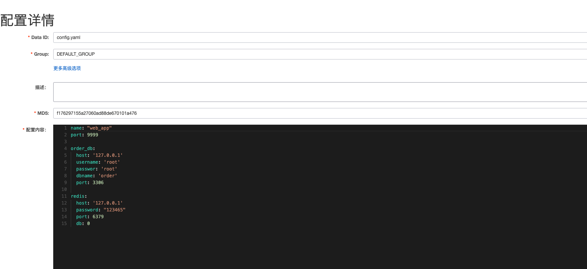
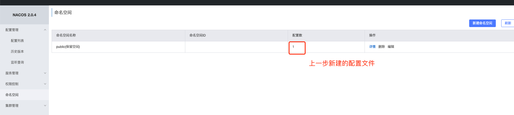
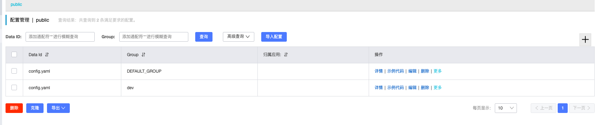

# Go集成nacos
github: https://github.com/nacos-group/nacos-sdk-go/blob/master/README_CN.md


## nacos
- 部署
```bash
docker pull nacos/nacos-server:v2.2.1

docker run --name nacos \
  -e MODE=standalone \
  -e JVM_XMS=512m -e JVM_MAX=512m \
  -e JVM_XMN=256m -p 8848:8848 \
  -d nacos/nacos-server:v2.2.1
  
浏览器访问： 127.0.0.1:8848/nacos/#/login
账号密码： nacos/nacos
```
- 配置
1. 新建配置

2. 命名空间
可以新建命名空间，也可以使用默认的public

3. 组 - 隔离
场景：把不同微服务的开发、测试、生成配置文件隔离（相同名字的配置文件，属于不同的组）

1. Data ID - 配置集
一个配置集就是一个配置文件, 还可以将db,server内容等配置分开，实现更灵活的管理


## 配置
- 安装依赖
```bash
go get -u github.com/nacos-group/nacos-sdk-go
```

- 示例
```bash
package main

import (
    "fmt"
    "time"

    "github.com/nacos-group/nacos-sdk-go/clients"
    "github.com/nacos-group/nacos-sdk-go/common/constant"
    "github.com/nacos-group/nacos-sdk-go/vo"
)


func main() {
    // Note：我们可以配置多个ServerConfig，客户端会对这些服务端做轮询请求

    clientConfig := constant.ClientConfig{
        TimeoutMs:           5000,    // 请求Nacos服务端的超时时间，默认是10000ms
        NamespaceId:         "",      // 如果需要支持多namespace，我们可以场景多个client,它们有不同的NamespaceId。当namespace是public时，此处填空字符串。
        CacheDir:            "cache", // 缓存service信息的目录，默认是当前运行目录
        NotLoadCacheAtStart: false,   // 在启动的时候不读取缓存在CacheDir的service信息
        LogDir:              "log",   // 日志存储路径
        LogLevel:            "debug", // 日志默认级别，值必须是：debug,info,warn,error，默认值是info
    }

    serverConfigs := []constant.ServerConfig{
        {
            IpAddr:      "127.0.0.1",
            ContextPath: "/nacos",
            Port:        8848,
            Scheme:      "http",
        },
    }

    // 创建动态配置客户端的另一种方式 (推荐)
    configClient, err := clients.NewConfigClient(
        vo.NacosClientParam{
            ClientConfig:  &clientConfig,
            ServerConfigs: serverConfigs,
        },
    )
    if err != nil {
        panic(err)
    }

    content, err := configClient.GetConfig(vo.ConfigParam{
        DataId: "config.yaml",
        Group:  "dev", // 开发环境配置文件
    })

    if err != nil {
        panic(err)
    }
    fmt.Println(content)

    // 监听配置变化
    configClient.ListenConfig(vo.ConfigParam{
        DataId: "config.yaml",
        Group:  "dev",
        OnChange: func(namespace, group, dataId, data string) {
            fmt.Println("配置文件发生了变化...")
            fmt.Println("group:" + group + ", dataId:" + dataId + ", data:" + data)
        },
    })

    time.Sleep(300 * time.Second)
}

```

- 分离
目录结构
nacos_test
├── config
│   └── config.go
└── main.go

nacos
```bash
{
    "name": "user-web",
    "host": "10.2.106.169",
    "port": 9091,
    "tags":["iceymoss", "goods", "golang", "web"],
    "user_srv":{
        "name": "user-srv",
        "host": "10.2.106.169",
        "port": 8081
    },
    "jwt":{
        "key": "dfijdfjidhfjijdfbdfdFwohPd6XmVCdnQi"
    },
    "sms":{
        "key": "mykey",
        "secret": "mysecret"
    },
    "params":{
        "sign_name": "生鲜小店",
        "code": "**S_244610581"
    },
    "redis":{
        "host": "127.0.0.1",
        "port": 6379,
        "expir": 300
    },
    "verify":{
        "width": 5
    },
    "consul":{
        "host": "10.2.106.169",
        "port": 8500
    },
    "tracing":{
        "host": "127.0.0.1",
        "port": 6831,
        "name": "shopping"
    }

}

``


config.go
```bash
package config
 
//UserSerConfig 映射用户配置
type UserSerConfig struct {
    Name string `mapstructure:"name" json:"name"`
    Host string `mapstructure:"host" json:"host"`
    Port int    `mapstructure:"port" json:"port"`
}
 
//JWTConfig 映射token配置
type JWTConfig struct {
    SigningKey string `mapstructure:"key" json:"key"`
}
 
//AliSmsConfig 阿里秘钥
type AliSmsConfig struct {
    Apikey    string `mapstructure:"key" json:"key"`
    ApiSecret string `mapstructure:"secret" json:"secret"`
}
 
//ParamsConfig 短信模板配置
type ParamsConfig struct {
    SignName     string `mapstructure:"sign_name" json:"sign_name"`
    TemplateCode string `mapstructure:"code" json:"code"`
}
 
//RedisConfig redis数据库配置
type RedisConfig struct {
    Host  string `mapstructure:"host" json:"host"`
    Port  int    `mapstructure:"port" json:"port"`
    Expir int    `mapstructure:"expir" json:"expir"`
}
 
//Verifier 手机验证长度
type Verifier struct {
    Width int `mapstructure:"width" json:"width"`
}
 
type ConsulConfig struct {
    Host string `mapstructure:"host" json:"host"`
    Port int    `mapstructure:"port" json:"port"`
}
 
//ServerConfig  映射服务配置
type ServerConfig struct {
    Name        string        `mapstructure:"name" json:"name"`
    Port        int           `mapstructure:"port" json:"port"`
    UserSerInfo UserSerConfig `mapstructure:"user_srv" json:"user_srv"`
    JWTInfo     JWTConfig     `mapstructure:"jwt" json:"jwt"`
    AliSms      AliSmsConfig  `mapstructure:"sms" json:"sms"`
    Params      ParamsConfig  `mapstructure:"params" json:"params"`
    Redis       RedisConfig   `mapstructure:"redis" json:"redis"`
    Verify      Verifier      `mapstructure:"verify" json:"verify"`
    ConsulInfo  ConsulConfig  `mapstructure:"consul" json:"consul"`
}
```


main.go
```bash
package main
 
import (
    "StudyGin/nacos/config"
    "encoding/json"
    "fmt"

    "github.com/nacos-group/nacos-sdk-go/clients"
    "github.com/nacos-group/nacos-sdk-go/common/constant"
    "github.com/nacos-group/nacos-sdk-go/vo"
)
 
func main() {
    //服务端配置, nacos运行的socket
    sc := []constant.ServerConfig{
        {
            IpAddr: "10.2.81.102",
            Port:   8848,
        },
    }
 
    //客服端配置
    cc := constant.ClientConfig{
        NamespaceId:         "7ae18f62-e2b9-48bd-bff2-a49e7443f5bc", // 如果需要支持多namespace，我们可以场景多个client,它们有不同的NamespaceId
        TimeoutMs:           5000,
        NotLoadCacheAtStart: true,
        LogDir:              "tmp/nacos/log",
        CacheDir:            "tmp/nacos/cache",
        //RotateTime:          "1h",
        //MaxAge:              3,
        LogLevel: "debug",
    }
 
    configClient, err := clients.CreateConfigClient(map[string]interface{}{
        "serverConfigs": sc,
        "clientConfig":  cc,
    })
    if err != nil {
        panic(err)
    }
 
    //获取配置
    content, err := configClient.GetConfig(vo.ConfigParam{
        DataId: "user-web.json",
        Group:  "dev"})
 
    if err != nil {
        panic(err)
    }
    Config := &config.ServerConfig{}
 
  //将配置信息读取到config.ServerConfig{}对象中
    err = json.Unmarshal([]byte(content), &Config)
    if err != nil {
        panic(err)
    }
    fmt.Println(Config)
 
}

```
